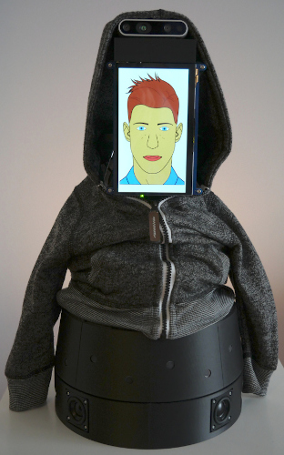

# T-Top

T-Top is a tabletop robot designed with advanced audio and vision sensors, deep learning perceptual processing and
telecommunication capabilities to provide richer interaction modalities and develop higher cognitive abilities from
interacting with people.

## Authors

- Marc-Antoine Maheux (@mamaheux)
- Charles Caya (@chcaya)
- Alexandre Filion (@alexfilion)
- Dominic Létourneau (@doumdi)
- Philippe Warren (@philippewarren)

## Licensing

- Source code files: [GPLv3](LICENSE_SOURCE_CODE)
- Other files: [Creative Commons Attribution-NonCommercial-ShareAlike 4.0 International Public License](LICENSE_OTHER)

## Features

| Category         | Type             | Description                                                                                                                                                                                       |
| ---------------- | ---------------- | ------------------------------------------------------------------------------------------------------------------------------------------------------------------------------------------------- |
| Power            | Power Adapter    | 19 V                                                                                                                                                                                              |
|                  | Battery          | 1x [RRC2054-2](https://www.rrc-ps.com/en/battery-packs/standard-battery-packs/products/RRC2054-2)                                                                                                 |
|                  | Battery Charger  | 1x [RRC-PMM240](https://www.rrc-ps.com/en/battery-packs/standard-battery-packs/products/RRC-PMM240)                                                                                               |
| Sensors          | Microphone Array | 16x [xSoundsMicrophones](https://github.com/introlab/xSoundsMicrophones), 1x [16SoundsUSB](https://github.com/introlab/16SoundsUSB)                                                               |
|                  | RGB-D Camera     | 1x [Intel RealSense D435i](https://www.intelrealsense.com/depth-camera-d435i/)                                                                                                                    |
|                  | Touchscreen      | 1x 7 inch 1024x600 capacitive touchscreen                                                                                                                                                         |
|                  | Current/Voltage  | [INA220](https://www.ti.com/product/INA220) or [INA226](https://www.ti.com/product/INA226)                                                                                                        |
| Actuators        | Stewart Platform | Displacement range: ±3 cm (x, y and z), ±20° (x and y), ±30° (z). Motor: [Dynamixel XL430-W250](https://emanual.robotis.com/docs/en/dxl/x/xl430-w250/)                                            |                                                         |
|                  | Rotating Base    | Displacement range: illimited. Motor: [Dynamixel XL430-W250](https://emanual.robotis.com/docs/en/dxl/x/xl430-w250/)                                                                               |
|                  | Speakers         | 4x [Dayton Audio DMA45-8](https://www.daytonaudio.com/product/1613/dma45-8-1-1-2-dual-magnet-aluminum-cone-full-range-driver-8-ohm), 2x [MAX9744](https://www.adafruit.com/product/1752)          |
|                  | Cooling          | 2x [Noctua NF-A4x20 5V](https://noctua.at/en/products/fan/nf-a4x20-5v)                                                                                                                            |
|                  | Touchscreen      | 1x 7 inch 1024x600 capacitive touchscreen                                                                                                                                                         |
|                  | LED              | Battery status                                                                                                                                                                                    |
| Network          | WiFi             | Intel Dual Band Wireless-AC 8265 NGW                                                                                                                                                              |
|                  | Ethernet         | 100 Mbps                                                                                                                                                                                          |
| Processing       | Computer         | [NVIDIA Jetson AGX Xavier Developer Kit](https://developer.nvidia.com/embedded/jetson-agx-xavier-developer-kit)                                                                                   |
|                  | Motor MCU        | [OpenCR](https://robots.ros.org/opencr/)                                                                                                                                                          |
|                  | Battery MCU      | [Teensy LC](https://www.pjrc.com/teensy/teensyLC.html)                                                                                                                                            |
| Perceptions      | -                | SLAM, Object detection, person pose estimation, face recognition, sound classification, speaker identification, robot name detection, speech to text, person identification, music beat detection |
| Behaviors        | -                | Telepresence, emotions, talking, greeting, face following, dancing, exploring, sound following                                                                                                    |

## Repository Structure

- The [documentation](documentation) folder contains the documentation to build and configure T-Top.
- The [CAD](CAD) folder contains the SolidWorks files of the robot. Il also contains the DXF and STL files to cut and
  print custom parts.
- The [firmwares](firmwares) folder contains the firmware for the MCUs.
- The [PCB](PCB) folder contains the KiCad files of the custom PCBs. Il also contains the Gerber files to manufacture
  the PCBs.
- The [ros](ros) folder contains the ROS packages to use the robot.
- The [tools](tools) folder contains the tools to develop and use the robot.

## Development Computer Setup

See [01_COMPUTER_CONFIGURATION.md](documentation/assembly/01_COMPUTER_CONFIGURATION.md#development-computer-ubuntu-2004)

## Papers

- [M.-A. Maheux, C. Caya, D. Létourneau, and F. Michaud, “T-top, a sar experimental platform,” in Proceedings of the 2022 ACM/IEEE International Conference on Human-Robot Interaction, 2022, p. 904–908.](https://dl.acm.org/doi/abs/10.5555/3523760.3523902)

## Sponsor

[IntRoLab - Intelligent / Interactive / Integrated / Interdisciplinary Robot Lab](https://introlab.3it.usherbrooke.ca)
