# Computer Configuration

## Onboard Computer - Jetson AGX Xavier

### A. Install the Auto Power On Jumper

| Part                                  | Quantity | Image                                                                                        |
| ------------------------------------- | -------- | -------------------------------------------------------------------------------------------- |
| `Nvidia Jetson AGX Xavier`            | 1        | 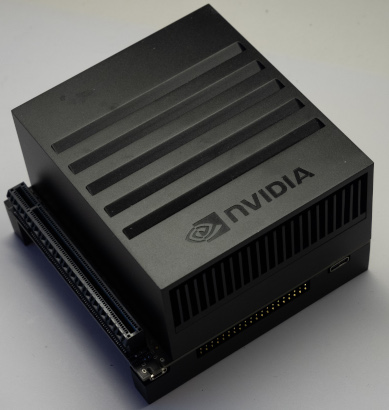                        |
| `Jumper`                              | 1        |                                                                                              |

#### Steps

1. Install the jumper as shown in the following picture.

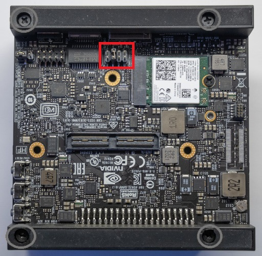

### B. Install the SSD

#### Required Parts

| Part                                  | Quantity | Image                                                                                        |
| ------------------------------------- | -------- | -------------------------------------------------------------------------------------------- |
| `Nvidia Jetson AGX Xavier`            | 1        |                         |
| `SSD`                                 | 1        | 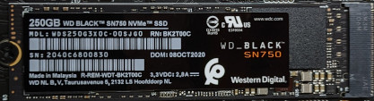                                                           |

#### Steps

1. Remove the following screws.

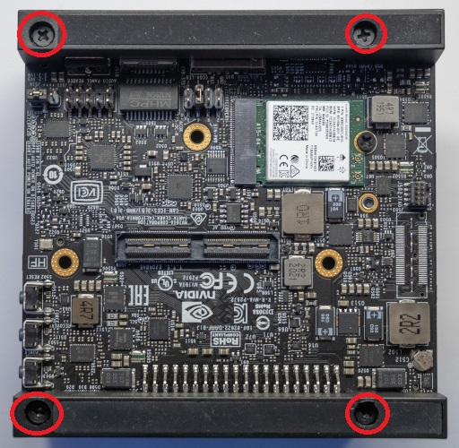

2. Remove the bottom PCB.
3. Install the SSD, as shown in the following picture.

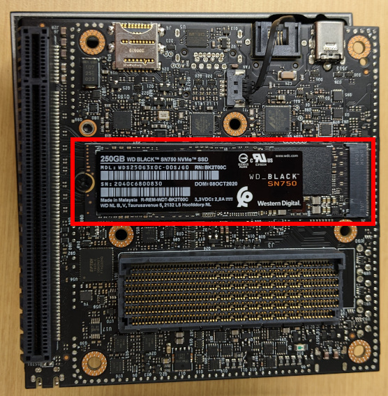

### C. Remove dV/dt protection feature

#### Required Parts

| Part                                  | Quantity | Image                                                                                        |
| ------------------------------------- | -------- | -------------------------------------------------------------------------------------------- |
| `Nvidia Jetson AGX Xavier`            | 1        |                         |

#### Steps

1. Remove R135 (see [P2822_B03_PCB_assembly_drawing.pdf](http://developer.nvidia.com/embedded/dlc/jetson-xavier-developer-kit-carrier-board-design-files-b03)).
2. Replace the bottom PCB.
1. Install the following screws.


### D. Install the WiFi Card

#### Required Parts

| Part                                  | Quantity | Image                                                                                        |
| ------------------------------------- | -------- | -------------------------------------------------------------------------------------------- |
| `Nvidia Jetson AGX Xavier`            | 1        |                         |
| `WiFi Card`                           | 1        | 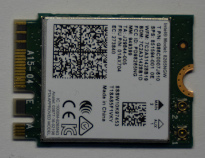                                               |

#### Steps

1. Install the `WiFi card` into the `Nvidia Jetson AGX Xavier`.

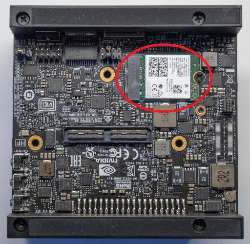

## Onboard Computer - Jetson AGX Orin

### A. Install the SSD

#### Required Parts

| Part                                  | Quantity | Image                                                                                        |
| ------------------------------------- | -------- | -------------------------------------------------------------------------------------------- |
| `Nvidia Jetson AGX Orin`              | 1        | 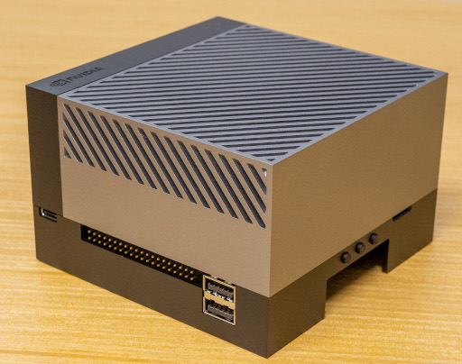                            |
| `SSD`                                 | 1        |                                                            |

#### Steps

1. Install the SSD, as shown in the following picture.

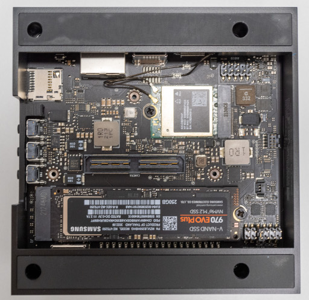

## Onboard Computer - Common Software Setup

### A. Install JetPack 5.1.1

1. Install JetPack 5.1.1 onto the computer SSD using the [instructions from Nvidia](https://developer.nvidia.com/embedded/jetpack)

### B. Connect the screen

#### Required Parts

| Part                                         | Quantity | Image                                                                      |
| -------------------------------------------- | -------- | -------------------------------------------------------------------------- |
| `HDMI Cable`                                 | 1        | 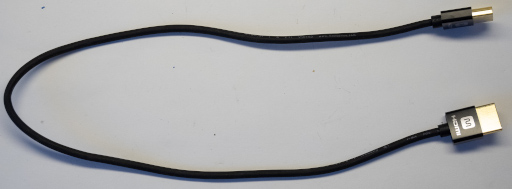                           |
| `Touchscreen`                                | 1        | 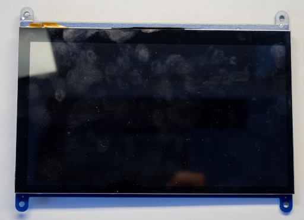                              |

#### Steps

1. Connect the screen to the Jetson using the HDMI cable.
2. Turn on the `touchscreen` as shown in the following picture.

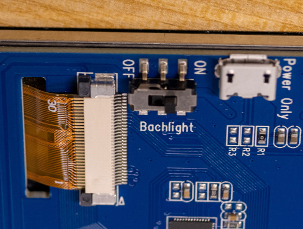

### C. Rotate the display
1. Open "Settings"
2. Navigate to the "Display" tab
3. Set the orientation to 'Portrait Left" a shown below

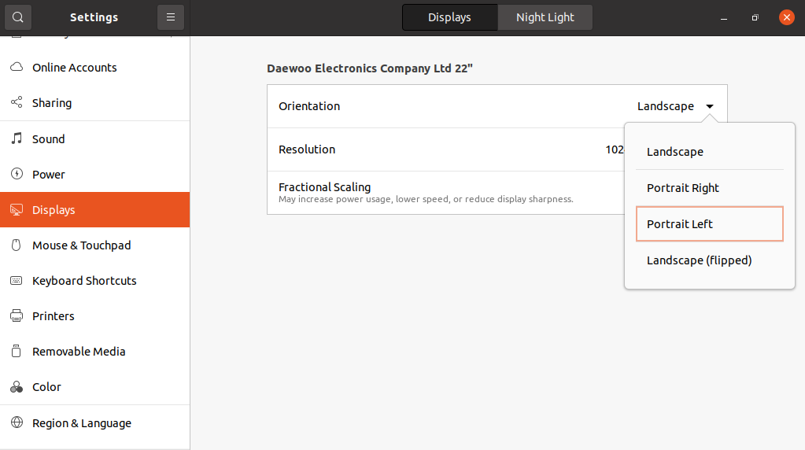

4. Select "Keep changes" when prompted

### D. Run the setup script

1. Execute the following bash command on the robot.

```bash
wget -q -O - https://raw.githubusercontent.com/introlab/t-top/main/tools/setup_scripts/jetson_configuration.sh | bash
```

#### Alternate way: manual setup

### D. Update the robot
Execute the following bash commands on the robot.

```bash
sudo apt update
sudo apt upgrade -y
sudo apt autoremove -y
```

### E. Clone the repository
Execute the following bash commands on the robot to clone the T-Top repository.

```bash
mkdir -p ~/t-top_ws/src
cd ~/t-top_ws/src

git clone --recurse-submodules https://github.com/introlab/t-top.git
```

### F. Configure the Jetson power mode
For the Jetson AGX Xavier, execute the following bash command on the robot.

```bash
sudo nvpmodel -m 0
```

For the Jetson AGX Orin, execute the following bash commands on the robot.

```bash
sudo cp /etc/nvpmodel.conf /etc/nvpmodel/nvpmodel.conf.backup
sudo cp ~/t-top_ws/src/t-top/tools/setup_scripts/files/jetson_orin_nvpmodel.conf /etc/nvpmodel.conf

sudo nvpmodel -m 1 &> /dev/null
sudo nvpmodel -m 0
```

### G. System configuration
1. Disable the sudo password requirement for `shutdown` and `nvpmodel` by executing the following bash command on the robot.

```bash
sudo cp ~/t-top_ws/src/t-top/tools/setup_scripts/files/sudoers_ttop /etc/sudoers.d/ttop
```

2. Copy [99-teensy.rules](../../tools/udev_rules/99-teensy.rules) in `/etc/udev/rules.d/`.

```bash
sudo cp ~/t-top_ws/src/t-top/tools/udev_rules/99-teensy.rules /etc/udev/rules.d/
```

3. Copy [99-camera-2d-wide.rules](../../tools/udev_rules/99-camera-2d-wide.rules) in `/etc/udev/rules.d/`.

```bash
sudo cp ~/t-top_ws/src/t-top/tools/udev_rules/99-camera-2d-wide.rules /etc/udev/rules.d/
```

4. Add the user to the `dialout` group by executing the following bash command on the robot.

```bash
sudo usermod -a -G dialout $USER
```

5. Setup autologin in the settings menu.

6. Disable automatic sleep and screen lock by executing the following bash commands on the robot.

```bash
gsettings set org.gnome.desktop.screensaver ubuntu-lock-on-suspend 'false'
gsettings set org.gnome.desktop.screensaver lock-delay 0
gsettings set org.gnome.desktop.session idle-delay 0
```

8. Add `Option "CalibrationMatrix" "0 1 0 -1 0 1 0 0 1"` before `EndSection` in the following section of `/usr/share/X11/xorg.conf.d/40-libinput.conf`.

```
Section "InputClass"
        Identifier "libinput touchscreen catchall"
        MatchIsTouchscreen "on"
        MatchDevicePath "/dev/input/event*"
        Driver "libinput"
EndSection
```

### H. Install NPM
1. Execute the following bash commands.

```bash
sudo apt install -y curl software-properties-common
curl -sL https://deb.nodesource.com/setup_14.x | sudo -E bash -
sudo apt install -y nodejs
```

### I. Install Tools
1. Execute the following bash commands.

```bash
sudo apt install -y htop python3-pip perl
sudo -H pip3 install -U jetson-stats

# Update CMake
wget -O - https://apt.kitware.com/keys/kitware-archive-latest.asc 2>/dev/null | gpg --dearmor - | sudo tee /etc/apt/trusted.gpg.d/kitware.gpg >/dev/null
sudo apt-add-repository "deb https://apt.kitware.com/ubuntu/ $(lsb_release -cs) main"
sudo apt update
sudo apt install -y cmake
```

### J. Install Librealsense 2
1. Execute the following bash commands.

```bash
mkdir ~/deps
cd ~/deps

git clone https://github.com/jetsonhacks/buildLibrealsense2Xavier.git
cd buildLibrealsense2Xavier
```

2. Change the version to `v2.50.0` in `installLibrealsense.sh`.
3. Add the folowing arguments to the `cmake` command in `installLibrealsense.sh`.

```bash
-DCMAKE_CXX_FLAGS="-march=native -ffast-math" -DCMAKE_C_FLAGS="-march=native -ffast-math"
```

4. Execute the following bash commands.

```bash
# Cannot be installed to build librealsense
sudo apt autoremove -y libapriltag-dev
./installLibrealsense.sh
sudo apt install -y libapriltag-dev
```

### K. Install ROS
1. Execute the following bash commands.

```bash
sudo sh -c 'echo "deb http://packages.ros.org/ros/ubuntu $(lsb_release -sc) main" > /etc/apt/sources.list.d/ros-latest.list'
curl -s https://raw.githubusercontent.com/ros/rosdistro/master/ros.asc | sudo apt-key add -
sudo apt update

sudo apt install -y \
    python3-rosdep \
    python3-rosinstall-generator \
    python3-vcstool \
    build-essential \
    libboost-all-dev \
    libpoco-dev \
    python3-empy \
    libtinyxml-dev \
    libtinyxml2-dev \
    qt5-default \
    sip-dev \
    python3-sip \
    python3-sip-dbg \
    python3-sip-dev \
    python3-pyqt5 \
    python3-nose \
    python3-twisted \
    python3-serial \
    python3-autobahn \
    python3-tornado \
    python3-bson \
    python3-qt-binding \
    libcurl4-gnutls-dev \
    libgtest-dev \
    liblz4-dev \
    libfltk1.1-dev \
    liburdfdom-headers-dev \
    liburdfdom-dev \
    liburdfdom-tools \
    libgpgme-dev \
    libyaml-cpp-dev \
    libpcl-dev \
    libgtk-3-dev \
    libassimp-dev \
    libogre-1.9-dev \
    libconfig-dev \
    liblog4cplus-dev \
    alsa-utils \
    liblog4cpp5-dev \
    liblog4cxx-dev \
    libbz2-dev \
    libbullet-dev \
    libsdl1.2-dev \
    libsdl-image1.2-dev \
    libapriltag-dev \
    libdc1394-22-dev

# Install system dependencies
cd ~/deps
git clone https://github.com/ros/console_bridge.git
cd console_bridge
mkdir build
cd build
cmake .. -DCMAKE_BUILD_TYPE=Release -DCMAKE_CXX_FLAGS="-march=native -ffast-math" -DCMAKE_C_FLAGS="-march=native -ffast-math"
cmake --build .
sudo cmake --install .

cd ~/deps
git clone https://github.com/ethz-asl/libnabo.git
cd libnabo
mkdir build
cd build
cmake .. -DCMAKE_BUILD_TYPE=Release -DCMAKE_CXX_FLAGS="-march=native -ffast-math" -DCMAKE_C_FLAGS="-march=native -ffast-math"
cmake --build .
sudo cmake --install .

cd ~/deps
git clone https://github.com/ethz-asl/libpointmatcher.git
cd libpointmatcher
mkdir build
cd build
cmake .. -DCMAKE_BUILD_TYPE=Release -DCMAKE_CXX_FLAGS="-march=native -ffast-math" -DCMAKE_C_FLAGS="-march=native -ffast-math"
cmake --build .
sudo cmake --install .

cd ~/deps
git clone -b 0.21.1-noetic https://github.com/introlab/rtabmap.git
cd rtabmap/build
cmake .. -DCMAKE_BUILD_TYPE=Release -DCMAKE_CXX_FLAGS="-march=native -ffast-math" -DCMAKE_C_FLAGS="-march=native -ffast-math"
cmake --build . -j4
sudo cmake --install .

# Install ROS
sudo rosdep init
rosdep update

mkdir -p ~/ros_catkin_ws/src
cd ~/ros_catkin_ws

rosinstall_generator desktop_full --rosdistro noetic --deps --tar > noetic-desktop.rosinstall
vcs import --input noetic-desktop.rosinstall ./src
rosdep install --from-paths ./src --ignore-packages-from-source --rosdistro noetic -y

# Remove useless packages
rm -rf ~/ros_catkin_ws/src/gazebo_ros_pkgs/

# Add ROS packages
cd ~/ros_catkin_ws/src
git clone -b 1.0.1 https://github.com/GT-RAIL/rosauth.git
git clone -b noetic-devel https://github.com/ros-drivers/rosserial.git
git clone -b ros1 https://github.com/RobotWebTools/rosbridge_suite.git
git clone -b noetic https://github.com/ccny-ros-pkg/imu_tools.git
git clone --recursive https://github.com/orocos/orocos_kinematics_dynamics.git

git clone -b 0.21.1-noetic https://github.com/introlab/rtabmap_ros.git
git clone -b noetic-devel https://github.com/ros-planning/navigation.git

git clone -b kinetic-devel https://github.com/pal-robotics/ddynamic_reconfigure.git
git clone -b 2.3.2 https://github.com/IntelRealSense/realsense-ros.git
git clone https://github.com/OTL/cv_camera.git
git clone -b 0.6.4-noetic https://github.com/introlab/find-object.git

# Replace not complete packages
rm -rf geometry2 navigation_msgs vision_opencv image_common perception_pcl pcl_msgs image_transport_plugins

git clone -b noetic-devel https://github.com/ros/geometry2.git
git clone -b ros1 https://github.com/ros-planning/navigation_msgs.git
git clone -b noetic https://github.com/ros-perception/vision_opencv.git
git clone -b noetic-devel https://github.com/ros-perception/image_common.git

git clone -b 1.7.1 https://github.com/ros-perception/perception_pcl.git
git clone -b noetic-devel https://github.com/ros-perception/pcl_msgs.git
git clone -b noetic-devel https://github.com/ros-perception/image_transport_plugins.git


cd ~/ros_catkin_ws
rosdep install --from-paths ./src/image_transport_plugins --ignore-packages-from-source --rosdistro noetic -y
# Can not be installed for the build, as CMake will pick it instead of the system 3.8
sudo apt autoremove -y python3.9

catkin config --init --install --space-suffix _isolated --cmake-args -DCMAKE_BUILD_TYPE=Release -DCMAKE_CXX_FLAGS="-march=native -ffast-math" -DCMAKE_C_FLAGS="-march=native -ffast-math" -DPYTHON_EXECUTABLE=/usr/bin/python3 -DCATKIN_ENABLE_TESTING=0 -Wno-dev
catkin build

# Add ROS setup to .bashrc
echo "source ~/ros_catkin_ws/install_isolated/setup.bash" >> ~/.bashrc
source ~/.bashrc
```

### L. Install System Dependencies

1. Execute the following bash commands.

```bash
sudo apt install -y \
    libasound2-dev \
    libpulse-dev \
    libconfig-dev \
    alsa-utils \
    gfortran \
    libgfortran-*-dev \
    texinfo \
    libfftw3-dev \
    libsqlite3-dev \
    portaudio19-dev \
    python3-all-dev \
    libgecode-dev \
    qt5-default \
    v4l-utils \
    libopenblas-dev \
    libpython3-dev \
    ffmpeg \
    chromium-browser \
    libqt5websockets5-dev \
    libqt5charts5-dev \
    libgstreamer1.0-dev \
    libgstreamer-plugins-base1.0-dev \
    libgstreamer-plugins-good1.0-dev \
    libgstreamer-plugins-bad1.0-dev \
    gstreamer1.0-plugins-base \
    gstreamer1.0-plugins-good \
    gstreamer1.0-plugins-bad \
    gstreamer1.0-plugins-ugly \
    gstreamer1.0-libav \
    gstreamer1.0-tools \
    libspdlog-dev \
    scons

# Install onnxruntime
cd ~/deps
git clone https://github.com/microsoft/onnxruntime.git -b v1.14.1 --recurse-submodules
cd onnxruntime
./build.sh --config Release --update --build --parallel --build_wheel --build_shared_lib --use_tensorrt --cuda_home /usr/local/cuda --cudnn_home /usr/lib/aarch64-linux-gnu --tensorrt_home /usr/lib/aarch64-linux-gnu
cd build/Linux/Release
sudo make install

# Install ComputeLibrary
cd ~/deps
git clone --depth 1 -b v22.11 https://github.com/ARM-software/ComputeLibrary.git
cd ComputeLibrary
scons Werror=1 -j8 debug=0 neon=1 opencl=0 os=linux arch=armv8a build=native
mv build lib

# Install onDNN
cd ~/deps
git clone --depth 1 -b v3.2.1 https://github.com/oneapi-src/oneDNN.git
cd oneDNN
mkdir build
cd build
export ACL_ROOT_DIR=~/deps/ComputeLibrary
cmake .. -DCMAKE_BUILD_TYPE=Release -DCMAKE_CXX_FLAGS="-march=native -ffast-math" -DCMAKE_C_FLAGS="-march=native -ffast-math -DDNNL_AARCH64_USE_ACL=ON"
cmake --build . -j4
sudo cmake --install .
```

### M. Install Python Dependencies

1. Execute the following bash commands.

```bash
# Install general dependencies
sudo apt install -y \
    'libprotobuf*' \
    protobuf-compiler \
    ninja-build \
    python3-numpy \
    python3-scipy \
    python3-numba \
    python3-matplotlib \
    python3-sklearn \
    python3-tqdm \
    python3-audioread \
    python3-requests \
    python3-sphinx

sudo -H pip3 install 'cython>=0.29.22,<0.30.0'
sudo -H pip3 install -r ~/t-top_ws/src/t-top/tools/setup_scripts/files/requirements.txt

#Install CTranslate2
cd ~/deps
git clone --depth 1 -b v3.20.0 https://github.com/OpenNMT/CTranslate2.git --recurse-submodule
cd CTranslate2
mkdir build
cd build
cmake .. -DCMAKE_BUILD_TYPE=Release -DCMAKE_CXX_FLAGS="-march=native -ffast-math" -DCMAKE_C_FLAGS="-march=native -ffast-math" -DWITH_MKL=OFF -DWITH_CUDA=ON -DWITH_CUDNN=ON -DWITH_OPENBLAS=ON -DWITH_DNNL=ON -DWITH_RUY=ON
cmake --build . -j4
sudo cmake --install .
sudo ldconfig
cd ../python
sudo -H pip3 install -r install_requirements.txt
python3 setup.py bdist_wheel
sudo -H pip3 install dist/*.whl --no-deps --force-reinstall

# Install PyTorch for Jetson
cd ~/deps
wget https://developer.download.nvidia.com/compute/redist/jp/v50/pytorch/torch-1.12.0a0+2c916ef.nv22.3-cp38-cp38-linux_aarch64.whl
sudo -H pip3 install torch-1.12.0a0+2c916ef.nv22.3-cp38-cp38-linux_aarch64.whl

cd ~/deps
git clone --depth 1 -b v0.13.0 https://github.com/pytorch/vision.git
cd vision
mkdir -p build
cd build
cmake .. -DCMAKE_BUILD_TYPE=Release -DCMAKE_CXX_FLAGS="-march=native -ffast-math" -DCMAKE_C_FLAGS="-march=native -ffast-math" -DCMAKE_PREFIX_PATH=`python3 -c 'import torch;print(torch.utils.cmake_prefix_path)'` -DWITH_CUDA=ON
cmake --build . -j4
sudo cmake --install .
cd ~/deps/vision
sudo -H python3 setup.py install

cd ~/deps
git clone --depth 1 -b v0.12.0 https://github.com/pytorch/audio.git --recurse-submodule
cd audio
sudo bash -c 'echo "export PATH=/usr/local/cuda-11.4/bin:\$PATH" >> /root/.bashrc'
sudo bash -c 'sudo echo "export LD_LIBRARY_PATH=/usr/local/cuda-11.4/lib64:\$LD_LIBRARY_PATH" >> /root/.bashrc'
sudo -H pip3 install -r requirements.txt
sudo -H bash -c 'TORCH_CUDA_ARCH_LIST="7.2;8.7" CUDACXX=/usr/local/cuda/bin/nvcc python3 setup.py install'

cd ~/deps
git clone https://github.com/NVIDIA-AI-IOT/torch2trt
cd torch2trt
sudo -H python3 setup.py install --plugins
```

### N. Install the T-Top hardware daemon and system tray
1. Build and install the daemon:
```bash
cd ~/t-top_ws/src/t-top/system/daemon
mkdir build
cd build
cmake .. -DCMAKE_BUILD_TYPE=Release -DCMAKE_CXX_FLAGS="-march=native -ffast-math" -DCMAKE_C_FLAGS="-march=native -ffast-math"
cmake --build .
sudo cmake --install .
```
2. Build and install the system tray:
```bash
cd ~/t-top_ws/src/t-top/system/system_tray
mkdir build
cd build
cmake .. -DCMAKE_BUILD_TYPE=Release -DCMAKE_CXX_FLAGS="-march=native -ffast-math" -DCMAKE_C_FLAGS="-march=native -ffast-math"
cmake --build .
sudo cmake --install .
```
3. Enable the deamon service:
```bash
sudo systemctl enable ttop_hardware_daemon.service
sudo systemctl start ttop_hardware_daemon.service
```

### O. Build the Repository

1. Execute the following bash commands.

```bash
cd ~/t-top_ws

# Default development profile, using Debug
catkin config --init --cmake-args -DCMAKE_BUILD_TYPE=Debug -DCMAKE_CXX_FLAGS="-march=native -ffast-math" -DCMAKE_C_FLAGS="-march=native -ffast-math" -DPYTHON_EXECUTABLE=/usr/bin/python3 -DCMAKE_WARN_DEPRECATED=OFF -DCMAKE_EXPORT_COMPILE_COMMANDS=ON
# Release profile, build with 'catkin build --profile release'
catkin config --profile release --init --space-suffix _release --cmake-args -DCMAKE_BUILD_TYPE=Release -DCMAKE_CXX_FLAGS="-march=native -ffast-math" -DCMAKE_C_FLAGS="-march=native -ffast-math" -DPYTHON_EXECUTABLE=/usr/bin/python3 -DCMAKE_WARN_DEPRECATED=OFF -DCMAKE_EXPORT_COMPILE_COMMANDS=ON

catkin build
```

## Development Computer (Ubuntu 20.04)

### A. OpenCR Dev Rule

1. Copy [99-opencr-custom.rules](../../tools/udev_rules/99-opencr-custom.rules) in `/etc/udev/rules.d/`.
2. Copy [99-teensy.rules](../../tools/udev_rules/99-teensy.rules) in `/etc/udev/rules.d/`.
2. Copy [99-camera-2d-wide.rules](../../tools/udev_rules/99-camera-2d-wide.rules) in `/etc/udev/rules.d/`.
3. Add the user to the `dialout` group.

```bash
sudo usermod -a -G dialout $USER
```

### B. Install NPM

1. Execute the following bash commands.

```bash
sudo apt install -y curl software-properties-common
curl -sL https://deb.nodesource.com/setup_14.x | sudo -E bash -
sudo apt install -y nodejs
```

### C. Install ROS

1. Execute the following bash commands.

```bash
sudo sh -c 'echo "deb http://packages.ros.org/ros/ubuntu $(lsb_release -sc) main" > /etc/apt/sources.list.d/ros-latest.list'
curl -s https://raw.githubusercontent.com/ros/rosdistro/master/ros.asc | sudo apt-key add -
sudo apt update

sudo apt install -y ros-noetic-desktop-full
echo "source /opt/ros/noetic/setup.bash" >> ~/.bashrc
source ~/.bashrc
sudo rosdep init
rosdep update
sudo apt install -y \
    python3-rosinstall \
    python3-rosinstall-generator \
    python3-wstool \
    build-essential \
    ros-noetic-rosserial-python \
    ros-noetic-rosbridge-suite \
    ros-noetic-ddynamic-reconfigure \
    ros-noetic-imu-filter-madgwick \
    ros-noetic-cv-bridge \
    ros-noetic-rtabmap-ros \
    ros-noetic-cv-camera
```

### D. Install System Dependencies

1. Execute the following bash commands.

```bash
sudo apt install -y libasound2-dev \
    libpulse-dev \
    libconfig-dev \
    alsa-utils \
    gfortran \
    'libgfortran-*-dev' \
    texinfo \
    libfftw3-dev \
    libsqlite3-dev \
    portaudio19-dev \
    python3-all-dev \
    libgecode-dev \
    qt5-default \
    v4l-utils
```

### E. Install Python Dependencies

1. Execute the following bash commands.

```bash
sudo apt install -y 'libprotobuf*' protobuf-compiler ninja-build python3-pip python3-sklearn
sudo -H pip3 install numpy scipy matplotlib torch==1.11.0 torchvision==0.12.0 torchaudio==0.11.0 google-cloud-texttospeech google-cloud-speech libconf tqdm pyside2 sounddevice librosa requests ipinfo
sudo -H pip3 install 'git+https://github.com/cocodataset/cocoapi.git#subdirectory=PythonAPI'
```

### F. Install CUDA Tools (Optional)

1. Install [TensorRT](https://docs.nvidia.com/deeplearning/tensorrt/install-guide/index.html).
2. Install torch2trt.

```bash
cd ~/deps
git clone https://github.com/NVIDIA-AI-IOT/torch2trt
cd torch2trt
sudo python3 setup.py install --plugins
```

### G. Clone the Repository

1. Execute the following bash commands.

```bash
mkdir ~/t-top_ws
cd ~/t-top_ws
mkdir src
catkin_make

cd src
git clone --recurse-submodules git@github.com:introlab/t-top.git
```

### H. Install the RealSense Packages
1. Install [Librealsense](https://github.com/IntelRealSense/librealsense/blob/v2.39.0/doc/installation.md) (use the tag
   v2.50.0).
2. Install [ROS node](https://github.com/IntelRealSense/realsense-ros#step-2-install-intel-realsense-ros-from-sources)
   in `~/t-top_ws/src` (use the tag 2.3.2)

## All computer

### A. Setup Google Cloud

1. Create
   a [service account JSON keyfile](https://cloud.google.com/iam/docs/creating-managing-service-accounts#creating) for
   Google Cloud Text-to-Speech and Google Cloud Speech-to-Text.
2. Add the following line to `~/.bashrc`

```bash
export GOOGLE_APPLICATION_CREDENTIALS="[Path to the service account JSON keyfile]"
```

### B. Setup OpenWeatherMap

1. Create an [OpenWeatherMap API Key](https://home.openweathermap.org/users/sign_up).
2. Add the following line to `~/.bashrc`

```bash
export OPEN_WEATHER_MAP_API_KEY="[The key]"
```
