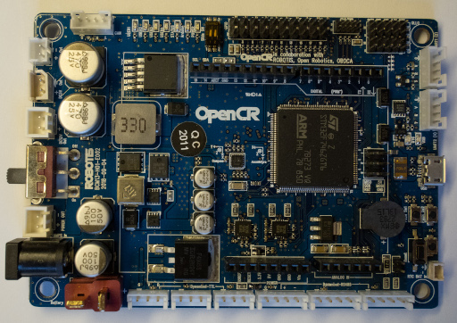

# 2. Dynamixel Configuration

## Required Parts
| Part                     | Quantity | Image                                                          |
| ------------------------ | -------- | ---------------------------------------------------------------|
| `Dynamixel XL430-W250-T` | 7        |  |
| `OpenCR`                 | 1        |                        |
| `Dynamixel Cable`        | 1        |    |
| `Micro USB Cable`        | 1        |                                                                |
| `12V Power Supply`       | 1        |                                                                |
| `Computer`               | 1        |                                                                |

## A. Computer Setup
1. Install the Arduino IDE.
    - [Windows](https://www.arduino.cc/en/Guide/Windows)
    - [Linux](https://www.arduino.cc/en/Guide/Linux)
2. Install the [OpenCR Board](https://emanual.robotis.com/docs/en/parts/controller/opencr10/#install-on-linux).

## B. Baud Rate Changes
1. Open the Arduino IDE.
2. Connect the `12V power supply` to the OpenCR.
3. Connect the `OpenCR` to the computer with the `micro USB cable`.
4. Make sure the `OpenCR` switch is OFF.
5. Connect the `OpenCR` and a `Dynamixel XL430-W250-T` with the `Dynamixel cable`.

6. Turn ON the `OpenCR` switch.
7. Use the `d_BPS_Change` example (`OpenCR/08. DynamixelWorkbench/d_BPS_Change`) to change the baud rate to 1000000.
    1. Change the value of `DXL_ID` according to the current configuration.
    2. Change the value of `BAUDRATE` according to the current configuration.
    3. Change the value of `NEW_BAUDRATE` to 1000000.
8. Program the OpenCR.
9. Open the serial monitor.
10. Wait until the baud rate has changed.
11. Turn OFF the `OpenCR` switch.
12. Disconnect the `Dynamixel XL430-W250-T`.
13. Repeat steps 4 to 11 for each `Dynamixel XL430-W250-T`.

## C. Id Changes
1. Connect the `12V power supply` to the OpenCR.
2. Connect the `OpenCR` to the computer with the `micro USB cable`.
3. Make sure the `OpenCR` switch is OFF.
4. Connect the `OpenCR` and a `Dynamixel XL430-W250-T` with the `Dynamixel cable`.

5. Turn ON the `OpenCR` switch.
6. Use the `c_ID_Change` example (`OpenCR/08. DynamixelWorkbench/c_ID_Change`) to change the id.
    1. Change the value of `BAUDRATE` to 1000000.
    2. Change the value of `DXL_ID` according to the initial configuration.
    3. Change the value of `NEW_DXL_ID` to 1.
7. Program the OpenCR.
8. Open the serial monitor.
9. Wait until the id has changed.
10. Turn OFF the `OpenCR` switch.
11. Disconnect the `Dynamixel XL430-W250-T`.
12. Identify the ID on the `Dynamixel XL430-W250-T`.
13. Repeat steps 4 to 12 for each `Dynamixel XL430-W250-T`, but increment the value of `NEW_DXL_ID` each time.
