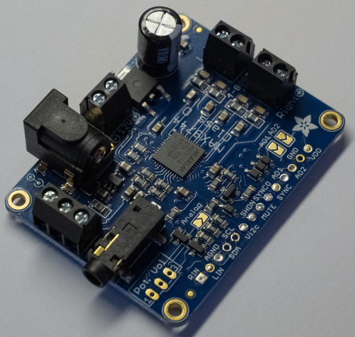
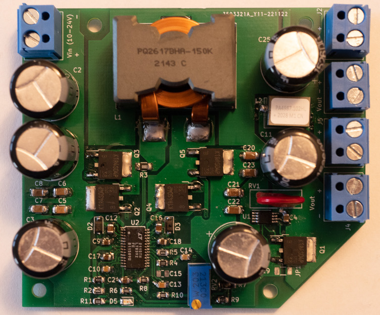
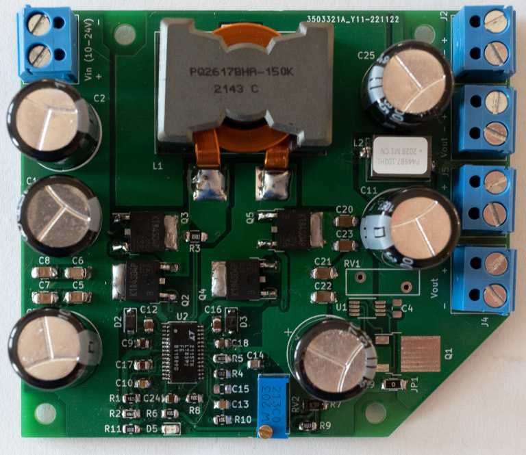
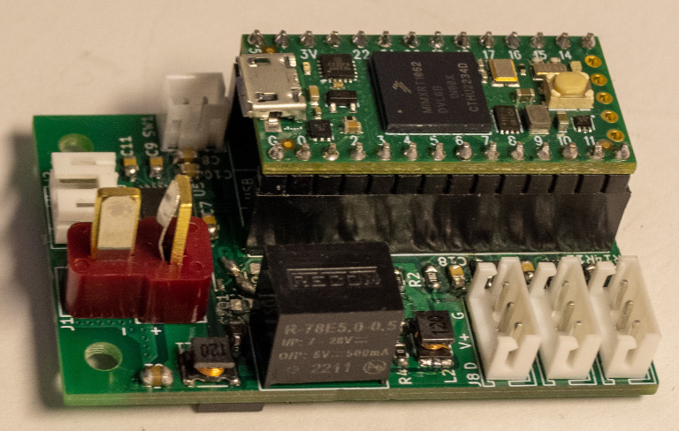

# 2. PCB Assembly

## A. Adafruit MAX

### Required Parts

| Part                   | Quantity | Image                                                                          |
| ---------------------- | -------- | -------------------------------------------------------------------------------|
| `Adafruit MAX9744 kit` | 2        |                |

### Steps

1. Solder the two `Adafruit MAX9744 kits` for digital control, but do not solder the
   headers ([instructions](https://learn.adafruit.com/adafruit-20w-stereo-audio-amplifier-class-d-max9744/assembly)).

2. Solder the `AD1` bridge on one of the `Adafruit MAX9744 kit`.

## B. PSU Control PCB

### Required Parts

See the [bill of materials](00_ORDER_PRINT_LASER_CUTTING.md#psu-control-pcb).

### Steps

1. Solder U3.
2. Solder C1.
3. Solder R9 and R10.
4. Solder R40 and R41.
5. Solder R14.
6. Solder R11 and R12.
7. Solder C3.

8. Solder Q2.
9. Solder Q3.
10. Solder R5, R6 and R13.
11. Solder C2.
12. Solder R39.
13. Solder R15, R18, R27, R28, R29, R30, R31, R32, R33, R34, R35 and R36.
14. Solder C7, C11, C12, C13, C15 and C16.

15. Solder TH2.
16. Solder R25 and R26.
17. Solder C25, C26, C27, C28, C29 and C30.

18. Solder U5.
19. Solder U8.
20. Solder C14 and C22.
21. Solder R3 and R4.
22. Solder R37 and R38.

23. Solder U7.
24. Solder C17, C18, C19, C20 and C21.

25. Solder Q4.
26. Solder R23 and R24.
27. Solder R21 and R22.
28. Solder D1, D2 and D3.
29. Solder C10 and C24.
30. Solder D6.
31. Solder U6.
32. Solder C8.
33. Solder R42.

34. Solder R43 and R44.
35. Solder C4 and C31.

36. Solder all JST PH male connectors (SW1, SW2, Sw3, SW4, SW5, SW6, J7, J8, J11, J12, J13, J14, J15, D4, D5, M1 and  M2).
36. Solder all JST XH male connectors (J6).
37. Solder L1 and L2.
38. Solder LS1.
39. Solder the fuse holders (F1).
40. Clip the fuse (F1).
41. Solder C5, C9 and C23.
42. Solder J1, J2 and J4.
43. Solder U4.
44. Cut the trace between the pads to separate VIN from VUSB.

45. Solder the male headers to the Teensy LC.

46. Solder the female headers (U2) to the PCB.
47. Solder D7.
48. Solder C6.
49. Clip the Teensy LC onto the PCB.

## C. 12V Buck-Boost PCB

### Required Parts

See the [bill of materials](00_ORDER_PRINT_LASER_CUTTING.md#buck-boost-pcb).

### Steps

1. Solder U2.
2. Solder D2 and D3.
3. Solder C12 and C16.
4. Solder Q2, Q3, Q4 and Q5.
5. Solder R3.
6. Solder C9, C18 and C24.
7. Solder C10, C13, C14 and C17.
8. Solder R1, R2, R4 and R5.
9. Solder R6, R8 and R10.
10. Solder R11 and D5.
11. Solder C5, C6, C7 and C8.
12. Solder C20, C21, C22 and C23.
13. Solder R7 and R9.
14. Solder U1.
15. Solder C4.
16. Solder Q1.

17. Solder R12.
18. Solder L2.
19. Solder J1, J2, J3, J4 and J5.
20. Solder L1.
21. Solder RV2.
22. Solder C1, C2, C3, C11 and C25.
23. Solder RV1.
24. Solder C19.

24. Adjust the output voltage to 11.5 V with RV2.

## D. 19V Buck-Boost PCB

### Required Parts

See the [bill of materials](00_ORDER_PRINT_LASER_CUTTING.md#buck-boost-pcb).

### Steps

1. Solder U2.
2. Solder D2 and D3.
3. Solder C12 and C16.
4. Solder Q2, Q3, Q4 and Q5.
5. Solder R3.
6. Solder C9, C18 and C24.
7. Solder C10, C13, C14 and C17.
8. Solder R1, R2, R4 and R5.
9. Solder R6, R8 and R10.
10. Solder R11 and D5.
11. Solder C5, C6, C7 and C8.
12. Solder C20, C21, C22 and C23.
13. Solder R7 and R9.
14. Solder JP1.

15. Solder R12.
16. Solder L2.
17. Solder J1, J2, J3, J4 and J5.
18. Solder L1.
19. Solder RV2.
20. Solder C1, C2, C3, C11 and C25.
21. Solder C19.

21. Adjust the output voltage to 19 V with RV2.

## E. Dynamixel Control PCB

### Required Parts

See the [bill of materials](00_ORDER_PRINT_LASER_CUTTING.md#dynamixel-control-pcb).

### Steps

1. Solder U6.
2. Solder C12.
3. Solder C13.
4. Solder C6.
5. Solder R10.
6. Solder R7 and R8.

7. Solder U5.
8. Solder C7, C8, C9, C10 and C11.

9. Solder U7.
10. Solder U8.
11. Solder R2 and R12.
12. SOlder R14.
13. Solder C15 and C18.

14. Solder Q2.
15. Solder Q3.
16. Solder C25.
17. Solder R15, R16 and R18.
18. Sodler R17.

19. Solder U2.
20. Solder R1 and R3.
21. Solder C4 and C5.

22. Solder C19, C22 and C23.
23. Solder L1 and L2.
24. Solder C1, C3 and C14.
25. Solder C2.
26. Solder R4 and R11.

27. Solder J2.
28. Solder Solder J8, J11 and J12.
29. Solder SW1.
30. Solder U1.
31. Cut the trace between the pads to separate VIN from VUSB.

31. Solder the male headers to the Teensy 4.0.

32. Solder the female headers (U4) to the PCB.
33. Solder J1.
34. Clip the Teensy 4.0 onto the PCB.

## F. Battery Charger - RRC-PMM240

### Required Parts

| Part                           | Quantity | Image                                                              |
| ------------------------------ | -------- | ------------------------------------------------------------------ |
| `Battery Charger - RRC-PMM240` | 1        |  |
| `JST B2P-VH Connector`         | 2        |          |

### Steps

1. Desolder the following connectors.

2. Solder the `JST B2P-VH connectors`, as shown in the following picture.

