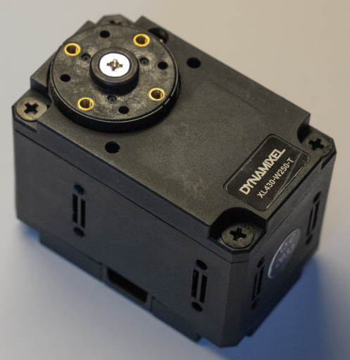
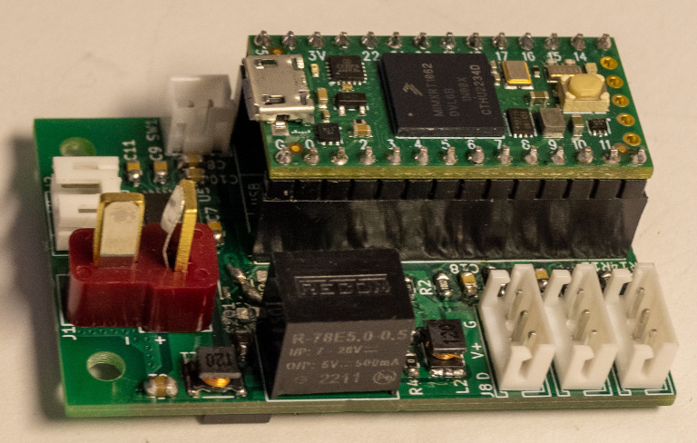

# 3. Dynamixel Configuration

## Required Parts

| Part                     | Quantity | Image                                                                  |
| ------------------------ | -------- | ---------------------------------------------------------------------- |
| `Dynamixel XL430-W250-T` | 7        |          |
| `Dynamixel Control PCB`  | 1        |  |
| `Dynamixel Cable`        | 1        |            |
| `Micro USB Cable`        | 1        |                                                                        |
| `12V Power Supply`       | 1        |                                                                        |
| `Computer`               | 1        |                                                                        |

## A. Computer Setup
1. Install [Visual Studio Code](https://code.visualstudio.com/download).
2. Install the [PlatformIO extension](https://platformio.org/platformio-ide).

## B. Setup the Dynamixel

1. Open the [project](../../firmwares/dynamixel_setup/) in PlatformIO.
2. Connect the `Dynamixel control PCB` to the computer with the `micro USB cable`.
3. Connect the `Dynamixel control PCB` and a `Dynamixel XL430-W250-T` with the `Dynamixel cable`.
4. Connect the `12V power supply` to the `Dynamixel control PCB`.
5. Change the value of `MOTOR_ID` according to the initial configuration.
6. Change the value of `MOTOR_BAUD_RATE` according to the initial configuration.
7. Change the value of `NEW_MOTOR_ID` to the desired id.
8. Program the `Dynamixel control PCB`.
9. Open the serial monitor.
10. Wait until the baud rate has changed.
11. Disconnect the `12V power supply`.
12. Disconnect the `Dynamixel XL430-W250-T`.
13. Repeat steps 3 to 12 for each `Dynamixel XL430-W250-T`.
