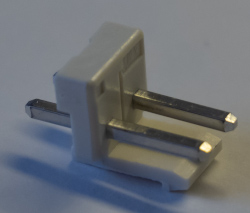

# 3. PCB Assembly

## A. Adafruit MAX

### Required Parts

| Part                   | Quantity | Image                                                                          |
| ---------------------- | -------- | -------------------------------------------------------------------------------|
| `Adafruit MAX9744 kit` | 2        |                |

### Steps

1. Solder the two `Adafruit MAX9744 kits` for digital control, but do not solder the
   headers ([instructions](https://learn.adafruit.com/adafruit-20w-stereo-audio-amplifier-class-d-max9744/assembly)).

2. Solder the `AD1` bridge on one of the `Adafruit MAX9744 kit`.

## B. PSU Control PCB

TODO update
### Required Parts

See the [bill of materials](00_ORDER_PRINT_LASER_CUTTING.md#psu-control-pcb).

### Steps

1. Solder U2.
2. Solder R3, R4, C2, C5, C3, R7, R8 and R9.
3. Solder R17, R16.
4. Solder Q1 and Q3.
5. Solder R1, R2, R5, R6, R12 and R15.
6. Solder R11, R10, R19 and R18.
7. Solder R30, TH2 and R27.
8. Solder R26, R25 and R24.
9. Solder U1, Q5 and U4.
10. Solder C1, C4, R23, R22.
11. Solder Q4 and Q6.
12. Solder D7, D8 and D9.
13. Solder C6, C7 and C9.
14. Solder R20, R21, R28 and R29.
15. Solder Q2.

16. Solder all JST XH male connectors (D1, D2, D3, D4, D5, D6, SW1, J4, J6, J7, J8, J9, TH1, M1 and M2).
17. Cut the trace between the pads to separate VIN from VUSB.

18. Solder the male headers to the Teensy LC.

19. Solder the female headers (U3) to the PCB.
20. Solder the fuse holders (F1).
21. Clip the fuse (F1).
22. Solder LS1.
23. Solder J1, J2, J3, J5 and J10.
24. Solder C8.
25. Solder RV1.
26. Solder U2.
27. Clip the Teensy LC onto the PCB.

## C. 12V Buck-Boost PCB

TODO update
### Required Parts

See the [bill of materials](00_ORDER_PRINT_LASER_CUTTING.md#buck-boost-pcb).

### Steps

1. Solder U2.
2. Solder D2 and D3.
3. Solder C12 and C16.
4. Solder Q2, Q3, Q4 and Q5.
5. Solder R3.
6. Solder C9, C18 and C24.
7. Solder C10, C13, C14 and C17.
8. Solder R1, R2, R4 and R5.
9. Solder R6, R8 and R10.
10. Solder R11 and D5.
11. Solder C5, C6, C7 and C8.
12. Solder C20, C21, C22 and C23.
13. Solder R7 and R9.
14. Solder U1.
15. Solder C4.
16. Solder Q1.

17. Solder R12.
18. Solder J1, J2, J3, J4 and J5.
19. Solder RV2.
20. Solder L1.
21. Solder C1, C2, C3, C11 and C25.
22. Solder C19.
23. Solder RV1.

24. Adjust the output voltage to 11.5 V with RV2.

## D. 19V Buck-Boost PCB

### Required Parts

See the [bill of materials](00_ORDER_PRINT_LASER_CUTTING.md#buck-boost-pcb).

### Steps

1. Solder U2.
2. Solder D2 and D3.
3. Solder C12 and C16.
4. Solder Q2, Q3, Q4 and Q5.
5. Solder R3.
6. Solder C9, C18 and C24.
7. Solder C10, C13, C14 and C17.
8. Solder R1, R2, R4 and R5.
9. Solder R6, R8 and R10.
10. Solder R11 and D5.
11. Solder C5, C6, C7 and C8.
12. Solder C20, C21, C22 and C23.
13. Solder R7 and R9.
14. Solder JP1.

15. Solder R12.
16. Solder J1, J2, J3, J4 and J5.
17. Solder RV2.
18. Solder L1.
19. Solder C1, C2, C3, C11 and C25.
20. Solder C19.

21. Adjust the output voltage to 19 V with RV2.

## E. Battery Charger - RRC-PMM240

### Required Parts

| Part                           | Quantity | Image                                                              |
| ------------------------------ | -------- | ------------------------------------------------------------------ |
| `Battery Charger - RRC-PMM240` | 1        |  |
| `JST B2P-VH Connector`         | 2        |          |

### Steps

1. Desolder the following connectors.

2. Solder the `JST B2P-VH connectors`, as shown in the following picture.

