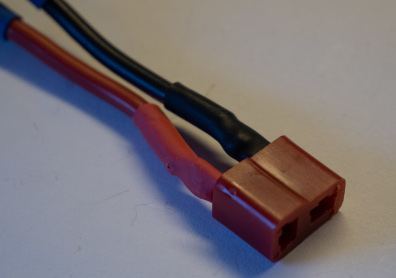

# 4. Cable Assembly

## A. 16SoundsUSB Cables
### Required Parts
| Part                    | Quantity | Image                                                               |
| ----------------------- | -------- | --------------------------------------------------------------------|
| `RJ12 Connector`        | 32       |                       |
| `RJ12 Flat Cable Spool` | 1        |      |

### Steps
1. Cut 16 `RJ12 flat cables` of 6 cm long.
2. For each cable, crimp 2 `RJ12 connectors` to create a crossover cable.

## B. LEDs

### Required Parts
| Part                                 | Quantity | Image                                                                                        |
| ------------------------------------ | -------- | -------------------------------------------------------------------------------------------- |
| `White LED`                          | 2        |                                              |
| `Green LED`                          | 1        |                                              |
| `Orange LED`                         | 1        |                                            |
| `Yellow LED`                         | 1        |                                            |
| `Red LED`                            | 1        |                                                  |
| `2-Position Female JST XH Connector` | 6        |  |
| `JST XH Crimp Contact`               | 12       |                              |
| `22 AWG Red Wire Spool`              | 1        |                                  |
| `22 AWG Black Wire Spool`            | 1        |                                |
| `Heat Shrink Tube`                   | 6        |                       |

### Steps
1. Cut 6 `22 AWG red wire` of 12 cm long.
2. Cut 6 `22 AWG black wire` of 12 cm long.
3. For each LED, solder a `22 AWG red wire` to the base of the longest LED pin.
4. For each LED, solder a `22 AWG black wire` to the base of the other LED pin.
5. Cut each LED pin at the base.

6. Crimp a `JST XH crimp contact` onto each wire.

7. For each LED, twist the wires.

8. Add a `heat shrink tube` onto the pins of each LED.

9. For each LED, insert the crimp contacts into a `2-position female JST XH connector`, as shown in the following picture.

## C. Fans

### Required Parts
| Part                                 | Quantity | Image                                                                                        |
| ------------------------------------ | -------- | -------------------------------------------------------------------------------------------- |
| `Fan`                                | 2        |                                                            |
| `2-Position Female JST XH Connector` | 2        |  |
| `JST XH Crimp`                       | 4        |                              |
| `Heat Shrink Tube`                   | 2        |                       |

### Steps
1. Remove the cable sleeve from each fan.

2. For the first fan, cut the wires to 10 cm long.
3. For the first fan, cut the wires to 20 cm long.
4. For each fan, cut the yellow wire 3 cm shorter.

5. For each fan, twist the wires.
6. For each fan, add a `heat shrink tube` to hold the yellow wire, as shown in the following picture.

7. For each fan, crimp a `JST XH crimp contact` onto the red and black wires.

8. For each fan, insert the crimp contacts into a `2-position female JST XH connector`, as shown in the following picture.

## D. Speakers

### Required Parts
| Part                                 | Quantity | Image                                                                                        |
| ------------------------------------ | -------- | -------------------------------------------------------------------------------------------- |
| `Speaker (Dayton Audio DMA45-8 1)`   | 4        |                                   |
| `20 AWG Red Wire Spool`              | 1        |                                  |
| `20 AWG Black Wire Spool`            | 1        |                                |
| `20 AWG Ferrule`                     | 8        |                                  |

### Steps
1. Cut a `20 AWG red wire` of 15 cm long and a `20 AWG black wire` of 15 cm long.
2. Cut a `20 AWG red wire` of 20 cm long and a `20 AWG black wire` of 20 cm long.
3. Cut a `20 AWG red wire` of 35 cm long and a `20 AWG black wire` of 35 cm long.
4. Cut a `20 AWG red wire` of 52 cm long and a `20 AWG black wire` of 52 cm long.
5. For each pair, solder the black wire to the biggest tab of a speaker.
6. For each pair, solder the red wire to the other tab of a speaker.

7. For each speaker, add a `heat shrink tube` to protect each tab.

8. For each speaker, twist the wires, as shown in the following picture.

9. For each speaker, add a `heat shrink tube` to hold the twisted wires, as shown in the following picture.

10. For each wire, crimp a `20 AWG ferrule`.

## E. Power Switch

### Required Parts
| Part                                 | Quantity | Image                                                                                        |
| ------------------------------------ | -------- | -------------------------------------------------------------------------------------------- |
| `Power Switch`                       | 4        |                                        |
| `22 AWG White Wire Spool`            | 1        |                              |
| `2-Position Female JST XH Connector` | 1        |  |
| `JST XH Crimp Contact`               | 2        |                              |
| `Heat Shrink Tube`                   | 4        |                       |

### Steps
1. Cut 2 `22 AWG red wire` of 38 cm long.
2. Solder the wires to the `power switch`.

3. Add a `heat shrink tube` to protect each tab.

4. Twist the wires.
7. Crimp a `JST XH crimp contact` onto the wires.

8. Insert the crimp contacts into a `2-position female JST XH connector`, as shown in the following picture.

## F. Limit Switch

### Required Parts
| Part                                 | Quantity | Image                                                                                        |
| ------------------------------------ | -------- | -------------------------------------------------------------------------------------------- |
| `Limit Switch`                       | 1        |                                        |
| `22 AWG White Wire Spool`            | 1        |                              |
| `22 AWG Black Wire Spool`            | 1        |                              |
| `Grove Cable`                        | 1        |                                          |
| `Heat Shrink Tube`                   | 2        |                       |

### Steps
1. Cut the `grove cable` in half.
2. Keep one half.
3. Remove the red and white wires.

4. Cut a `22 AWG white wire` of 32 cm long.
5. Cut a `22 AWG black wire` of 32 cm long.
6. Solder the wires to the `grove cable`, as shown in the following picture.

7. Add a `heat shrink tube` onto each connection.

8. Insert a `heat shrink tube` over each wire.
9. Solder the wires to the limit switch tabs (C and NC).

10. Put the `heat shrink tubes` over the tabs.

## G. Adafruit MAX9744

### Required Parts
| Part                                 | Quantity | Image                                                                                        |
| ------------------------------------ | -------- | -------------------------------------------------------------------------------------------- |
| `Adafruit MAX9744`                   | 2        |                                |
| `22 AWG Brown Wire Spool`            | 1        |                              |
| `22 AWG Green Wire Spool`            | 1        |                              |
| `22 AWG Black Wire Spool`            | 1        |                              |
| `3-Position Female JST XH Connector` | 2        |  |
| `JST XH Crimp Contact`               | 6        |                              |
| `20 AWG Red Wire Spool`              | 1        |                                  |
| `20 AWG Black Wire Spool`            | 1        |                                |
| `20 AWG Ferrule`                     | 8        |                                  |
| `Heat Shrink Tube`                   | 2        |                       |

### Steps
1. Cut 2 `22 AWG brown wires` of 40 cm long.
2. Cut 2 `22 AWG green wires` of 40 cm long.
3. Cut 2 `22 AWG black wires` of 40 cm long.
4. For each `Adafruit MAX9744`, solder a brown wire to the SDA pad.
5. For each `Adafruit MAX9744`, solder a green wire to the SCL pad.
6. For each `Adafruit MAX9744`, solder a black wire to the GND pad.

7. For each `Adafruit MAX9744`, twist the soldered wires.

8. For each `Adafruit MAX9744`, add a `heat shrink tube` to hold the twisted wires, as shown in the following picture.

9. For each `Adafruit MAX9744`, crimp a `JST XH crimp contact` onto each wire.

10. For each `Adafruit MAX9744`, insert the crimp contacts into a `3-position female JST XH connector`, as shown in the following picture.

11. Cut 2 `20 AWG red wires` of 24 cm long.
12. Cut 2 `20 AWG black wires` of 24 cm long.
13. For each wire, crimp a `20 AWG ferrule` on both ends.

## H. 19V Power Adapter
### Required Parts
| Part                           | Quantity | Image                                                                                    |
| ------------------------------ | -------- | ---------------------------------------------------------------------------------------- |
| `Robot Power Connector - Male` | 1        |  |
| `19V Power Adapter`            | 1        |                                                                                          |

### Steps
1. Cut the `19V power adapter` cable as shown in the following picture.

2. Solder the `Robot Power Connector - Male` to the `19V power adapter` cable.
    - Make sure the ground is outside.

## I. Battery Charger
| Part                                 | Quantity | Image                                                                                        |
| ------------------------------------ | -------- | -------------------------------------------------------------------------------------------- |
| `Robot Power Connector - Female`     | 1        |  |
| `16 AWG Red Wire Spool`              | 1        |                                  |
| `16 AWG Black Wire Spool`            | 1        |                              |
| `16 AWG Ferrule`                     | 4        |                                  |
| `JST VHR-2N Connector`               | 2        |                                  |
| `JST SVH-21T-1.1 Crimp Contact`      | 4        |                    |
| `JST PHR-6 Cable`                    | 1        |                                |
| `6-Position Female JST XH Connector` | 1        |  |
| `JST XH Crimp Contact`               | 5        |                              |
| `Heat Shrink Tube`                   | 2        |                       |

### Steps
1. Cut a `16 AWG red wire` of 8 cm long.
2. Cut a `16 AWG black wire` of 8 cm long.
3. For each wire, crimp a `16 AWG ferrule` on one end.

4. For each wire, crimp a `JST SVH-21T-1.1 crimp contact` on the other end.

5. Insert the wires into a `JST VHR-2N connector`, as shown in the following picture.

6. Cut a `16 AWG red wire` of 24.5 cm long.
7. Cut a `16 AWG black wire` of 24.5 cm long.
8. Solder the wires onto the `robot power connector`, as shown in the following picture.

9. Install a `heat shrink tube` onto each wire, as shown in the following picture.

10. For each wire, crimp a `JST SVH-21T-1.1 crimp contact` on the other end.

11. Insert the wires into a `JST VHR-2N connector`, as shown in the following picture.

12. Remove the following wire from the `JST PHR-6 cable`.

13. Cut the `JST PHR-6 cable` wires to 11 cm.
14. For each wire of the `JST PHR-6 cable`, crimp a `JST XH crimp contact`.

15. Insert the wires into a `6-Position female JST XH connector`, as shown in the following pictures.

## J. Slip Ring Cables
### Required Parts
| Part                              | Quantity | Image                                                                                          |
| --------------------------------- | -------- | ---------------------------------------------------------------------------------------------- |
| `Computer Power Connector`        | 1        |  |
| `T-Connector`                     | 1        |                                              |
| `Male Power Connector`            | 2        |                      |
| `Female Power Connector`          | 2        |                  |
| `Heat Shrink Tube`                | 4        |                         |
| `18 AWG Ferrule`                  | 4        |                                    |

### Steps
1. Crimp a `18 AWG ferrule` onto each wire of the first `male power connector` and the first `female power connector`.

2. Insert a `heat shrink tube` onto each remaining `power connector` wire.
2. Solder the black wire of the second `female power connector` to the wire connected to the outside of the `computer power connector`.
3. Solder the red wire of the second `female power connector` to the other wire of the `computer power connector`.
4. Install the `heat shrink tubes`.

5. Solder the black wire of the second `male power connector` to the black wire of the `T-connector`.
6. Solder the red wire of the second `male power connector` to the red wire of the `T-connector`.
7. Install the `heat shrink tubes`.

## K. Slip Ring
### Required Parts
| Part                                     | Quantity | Image                                                                                          |
| ---------------------------------------- | -------- | ---------------------------------------------------------------------------------------------- |
| `Slip Ring - M220-24 36wire 2A flange A` | 1        |                                                |
| `Male Power Connector`                   | 2        |                      |
| `Female Power Connector`                 | 2        |                  |
| `4-Position Female JST XH Connector`     | 1        |    |
| `JST XH Crimp Contact`                   | 4        |                                |
| `Grove Cable`                            | 1        |                                            |
| `Mini-USB Cable`                         | 1        |                                      |
| `Ethernet Cable`                         | 1        |                                      |
| `Big Heat Shrink Tube`                   | 14       |                         |
| `Small Heat Shrink Tube`                 | 24       |                       |

### Steps
1. Insert a `big heat shrink tube` onto each `power connector` wire.
2. Solder the black wire of the first `male power connector` to 7 wires of the bottom side of the `slip ring`.
3. Solder the black wire of the first `female power connector` to matching wires of the top side of the `slip ring`.
5. Solder the red wire of the first `male power connector` to 7 wires of the bottom side of the `slip ring`.
6. Solder the red wire of the first `female power connector` to matching wires of the top side of the `slip ring`.
7. Install the `big heat shrink tubes`.

8. Solder the black wire of the first `female power connector` to 5 wires of the bottom side of the `slip ring`.
9. Solder the black wire of the first `male power connector` to matching wires of the top side of the `slip ring`.
8. Solder the red wire of the first `female power connector` to 5 wires of the bottom side of the `slip ring`.
9. Solder the red wire of the first `male power connector` to matching wires of the top side of the `slip ring`.
10. Install the `big heat shrink tubes`.

11. Crimp `JST XH crimp contacts` onto 4 wires of the bottom side of the `slip ring`.
12. Insert a `small heat shrink tube` onto each matching wire of the top side of the `slip ring`.
13. Insert a `big heat shrink tube` onto each the matching wires of the top side of the `slip ring`.
14. Cut the `grove cable` in half.
15. Keep one half.
16. Solder each wire of the `grove cable` to a matching wire of the top side of the `slip ring`.
17. Install the `small heat shrink tubes`.
18. Install the `big heat shrink tube`.
19. Insert the crimp contacts into a `4-position female JST XH connector`, as shown in the following pictures and table.

| `JST XH Connector` | `Grove Cable` |
| ------------------ | ------------- |
| Red                | Red           |
| Orange             | Yellow        |
| Yellow             | White         |
| Black              | Black         |

20. Cut the `Mini-USB cable` in half.
21. Cut 4 wires of the bottom side of the `slip ring` near it.
22. Insert a `small heat shrink tube` onto each wire.
23. Insert a `big heat shrink tube` onto the `Mini-USB cable part`.
24. Solder each wire of the `Mini-USB cable part` onto a cutted wire.
25. Install the `small heat shrink tubes`.
26. Install the `big heat shrink tube`.

27. Cut the matching wires of the top side of the `slip ring` near it.
28. Insert a `small heat shrink tube` onto each wire.
29. Insert a `big heat shrink tube` onto the `USB-A cable part`.
30. Solder each wire of the `USB-A cable part` onto the matching cutted wire.
31. Install the `small heat shrink tubes`.
32. Install the `big heat shrink tube`.

33. Cut the `Ethernet cable` in half.
34. Cut 4 wires of the bottom side of the `slip ring` near it.
35. Insert a `small heat shrink tube` onto each wire.
36. Insert a `big heat shrink tube` onto a `Ethernet cable part`.
37. Solder the TX wires and the RX wires of the `Ethernet cable part` onto the cutted wires.
38. Install the `small heat shrink tubes`.
39. Install the `big heat shrink tube`.
40. Cut the matching wires of the top side of the `slip ring` near it.
41. Insert a `small heat shrink tube` onto each wire.
42. Insert a `big heat shrink tube` onto a `Ethernet cable part`.
43. Solder the TX wires and the RX wires of the `Ethernet cable part` onto the matching cutted wires.
44. Install the `small heat shrink tubes`.
45. Install the `big heat shrink tube`.

## L. Buck-Boost Wires
### Required Parts
| Part                                 | Quantity | Image                                                                                        |
| ------------------------------------ | -------- | -------------------------------------------------------------------------------------------- |
| `16 AWG Red Wire Spool`              | 1        |                                  |
| `16 AWG Black Wire Spool`            | 1        |                              |
| `16 AWG Ferrule`                     | 8        |                                  |

### Steps
1. Cut a `16 AWG red wire` of 6 cm long.
2. Cut a `16 AWG black wire` of 6 cm long.
3. Cut a `16 AWG red wire` of 8 cm long.
4. Cut a `16 AWG black wire` of 8 cm long.
5. For each wire, crimp a `16 AWG ferrule` on both ends.
