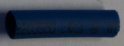
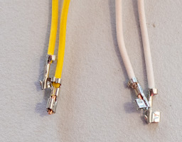
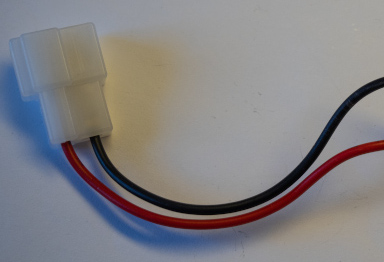
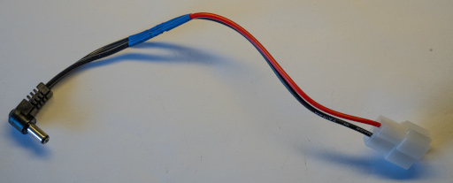
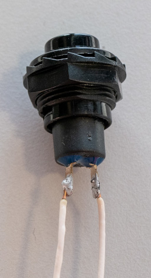

# 4. Cable Assembly

## A. 16SoundsUSB Cables

### Required Parts

| Part                    | Quantity | Image                                                               |
| ----------------------- | -------- | --------------------------------------------------------------------|
| `RJ12 Connector`        | 32       |                       |
| `RJ12 Flat Cable Spool` | 1        |          |

### Steps

1. Cut 16 `RJ12 flat cables` of 10 cm long.
2. For each cable, crimp 2 `RJ12 connectors` to create a crossover cable.

## B.1 LEDs

### Required Parts

| Part                                 | Quantity | Image                                                                                        |
|--------------------------------------| -------- |----------------------------------------------------------------------------------------------|
| `White LED`                          | 2        |                                                |
| `2-Position Female JST PH Connector` | 6        |        |
| `JST PH Crimp Contact`               | 12       |                                  |
| `22 AWG Red Wire Spool`              | 1        |                                    |
| `22 AWG Black Wire Spool`            | 1        |                                  |
| `Heat Shrink Tube`                   | 6        |                             |

### Steps

1. Cut 2 `22 AWG red wire` of 10 cm long.
2. Cut 2 `22 AWG black wire` of 10 cm long.
3. For each LED, solder a `22 AWG red wire` to the base of the longest LED pin.
4. For each LED, solder a `22 AWG black wire` to the base of the other LED pin.
5. Cut each LED pin at the base.

6. Crimp a `JST PH crimp contact` onto each wire.

7. For each white LED, twist the wires.

8. Add a `heat shrink tube` onto the pins of each LED.

9. For each LED, insert the crimp contacts into a `2-position female JST PH connector`, as shown in the following
   picture.

## B.2 RGB LEDS

### Required Parts

| Part                                 | Quantity | Image                                                                                        |
|--------------------------------------| -------- |----------------------------------------------------------------------------------------------|
| `LED Strip 30 per m`                 | 1        |                              |
| `LED Strip 144 per m`                | 1        |                            |
| `3 Position Female JST XH Cable`     | 3        |      |
| `3 Position Male JST XH Cable`       | 2        |          |

### Steps

1. Cut 2 stripes of 5 leds each using `LED Strip 144 per m`
2. Cut 1 stripe of 28 leds using `LED Strip 30 per m`
3. Cut 1 17cm `3 Position Female JST XH Cable`
4. Cut 1 6cm `3 Position Female JST XH Cable`
5. Cut 1 3cm `3 Position Female JST XH Cable`
6. Cut 1 6cm `3 Position Male JST XH Cable`
7. Cut 1 3cm `3 Position Male JST XH Cable`

8. Solder first 5 leds stripe with 17 cm `3 Position Female JST XH Cable` and 6 cm `3 Position Male JST XH Cable` as shown in the following picture.

9. Solder second 5 leds stripe with 6 cm `3 Position Female JST XH Cable` and 3 cm `3 Position Male JST XH Cable` as shown in the following picture.

10. Solder long 28 leds stripe `LED Strip 30 per m` with 3 cm `3 Position Female JST XH Cable` as shown in the following picture.

## C. Fans

### Required Parts

| Part                                  | Quantity | Image                                                                                        |
|---------------------------------------| -------- | -------------------------------------------------------------------------------------------- |
| `Fan`                                 | 2        |                                                            |
| `2-Position Female JST PH Connector`  | 2        |        |
| `JST PH Crimp Contact`                | 4        |                                  |
| `Heat Shrink Tube`                    | 2        |                             |

### Steps

1. Remove the cable sleeve from each fan.

2. For each fan, cut the wires to 15 cm long.
3. For each fan, cut the yellow wire 3 cm shorter.

4. For each fan, twist the wires.
5. For each fan, add a `heat shrink tube` to hold the yellow wire, as shown in the following picture.

6. For each fan, crimp a `JST PH crimp contact` onto the red and black wires.

7. For each fan, insert the crimp contacts into a `2-position female JST PH connector`, as shown in the following
   picture.

## D. Speakers

### Required Parts

| Part                                 | Quantity | Image                                                                                        |
| ------------------------------------ | -------- | -------------------------------------------------------------------------------------------- |
| `Speaker (Dayton Audio DMA45-8 1)`   | 4        |                                         |
| `20 AWG Red Wire Spool`              | 1        |                                    |
| `20 AWG Black Wire Spool`            | 1        |                                  |
| `20 AWG Ferrule`                     | 8        |                                      |
| `20 AWG 0.110" Blade Connector`      | 4        |                |
| `20 AWG 0.250" Blade Connector`      | 4        |                  |

### Steps

1. Cut a `20 AWG red wire` of 15 cm long and a `20 AWG black wire` of 15 cm long.
2. Cut a `20 AWG red wire` of 20 cm long and a `20 AWG black wire` of 20 cm long.
3. Cut a `20 AWG red wire` of 35 cm long and a `20 AWG black wire` of 35 cm long.
4. Cut a `20 AWG red wire` of 42 cm long and a `20 AWG black wire` of 42 cm long.
5. For each pair, crimp a `20 AWG 0.250" blade connector` on one end of the black wire.
6. For each pair, crimp a `20 AWG 0.110" blade connector` on one end of the red wire.

7. For each wire, crimp a `20 AWG ferrule` on the other end.

8. Install the wires onto the speakers.

## E. Power Switch

### Required Parts

| Part                                  | Quantity | Image                                                                                        |
|---------------------------------------|----------|----------------------------------------------------------------------------------------------|
| `Power Switch`                        | 1        |                                          |
| `22 AWG White Wire Spool`             | 1        |                                |
| `22 AWG Yellow Wire Spool`            | 1        |                              |
| `4-Position Female JST PH Connector`  | 1        |        |
| `JST PH Crimp Contact`                | 4        |                                  |
| `Heat Shrink Tube`                    | 4        |                             |

### Steps

1. Cut 2 `22 AWG white wire` of 38 cm long.
2. Cut 2 `22 AWG yellow wire` of 38 cm long.
2. Solder the wires to the `power switch`, as shown in the following picture.

3. Add a `heat shrink tube` to protect each tab.
4. Twist the wires.
7. Crimp a `JST PH crimp contact` onto the wires.

8. Insert the crimp contacts into a `4-position female JST 4PH connector`, as shown in the following picture.

## F. Limit Switch

### Required Parts

| Part                                 | Quantity | Image                                                                                        |
| ------------------------------------ | -------- | -------------------------------------------------------------------------------------------- |
| `Limit Switch`                       | 1        |                                          |
| `22 AWG White Wire Spool`            | 1        |                                |
| `2-Position Female JST PH Connector` | 2        |        |
| `JST PH Crimp Contact`               | 4        |                                  |

### Steps

1. Cut two `22 AWG white wire` of 25 cm long.
2. Solder the wires to the limit switch tabs (C and NC).

3. Insert a `heat shrink tube` over each wire.
4. Put the `heat shrink tubes` over the tabs.

5. Crimp a `JST PH crimp contact` onto each wire.

6. Twist wire together.

7. Insert the crimp contacts into a `2-position female JST PH connector`, as shown in the following
   picture.

## G. Adafruit MAX9744

### Required Parts

| Part                                 | Quantity | Image                                                                                        |
| ------------------------------------ | -------- | -------------------------------------------------------------------------------------------- |
| `Adafruit MAX9744`                   | 2        |                                  |
| `22 AWG Yellow Wire Spool`           | 1        |                               |
| `22 AWG Green Wire Spool`            | 1        |                                |
| `22 AWG Black Wire Spool`            | 1        |                                |
| `3-Position Female JST PH Connector` | 2        |        |
| `JST PH Crimp Contact`               | 6        |                                  |
| `20 AWG Red Wire Spool`              | 1        |                                    |
| `20 AWG Black Wire Spool`            | 1        |                                  |
| `20 AWG Ferrule`                     | 8        |                                      |
| `Heat Shrink Tube`                   | 2        |                             |

### Steps

1. Cut 2 `22 AWG yellow wires` of 55 cm long.
2. Cut 2 `22 AWG green wires` of 55 cm long.
3. Cut 2 `22 AWG black wires` of 55 cm long.
4. For each `Adafruit MAX9744`, solder a yellow wire to the SDA pad.
5. For each `Adafruit MAX9744`, solder a green wire to the SCL pad.
6. For each `Adafruit MAX9744`, solder a black wire to the GND pad.

7. For each `Adafruit MAX9744`, twist the soldered wires.

8. For each `Adafruit MAX9744`, add a `heat shrink tube` to hold the twisted wires, as shown in the following picture.

9. For each `Adafruit MAX9744`, crimp a `JST PH crimp contact` onto each wire.

10. For each `Adafruit MAX9744`, insert the crimp contacts into a `3-position female JST PH connector`, as shown in the
    following picture.

11. Cut 2 `20 AWG red wires` of 25 cm long.
12. Cut 2 `20 AWG black wires` of 25 cm long.
13. For each wire, crimp a `20 AWG ferrule` on both ends.

## H. 19V Power Adapter

### Required Parts

| Part                           | Quantity | Image                                                                                    |
| ------------------------------ | -------- | ---------------------------------------------------------------------------------------- |
| `Robot Power Connector - Male` | 1        |        |
| `19V Power Adapter`            | 1        |                                                                                          |

### Steps

1. Cut the `19V power adapter` cable as shown in the following picture.

2. Solder the `Robot Power Connector - Male` to the `19V power adapter` cable.
    - Make sure the ground is outside.

## I. Battery Charger

| Part                                 | Quantity | Image                                                                                        |
| ------------------------------------ | -------- | -------------------------------------------------------------------------------------------- |
| `Robot Power Connector - Female`     | 1        |        |
| `16 AWG Red Wire Spool`              | 1        |                                    |
| `16 AWG Black Wire Spool`            | 1        |                                |
| `16 AWG Ferrule`                     | 4        |                                      |
| `JST VHR-2N Connector`               | 2        |                                    |
| `JST SVH-21T-1.1 Crimp Contact`      | 4        |                      |
| `JST PHR-6 Cable`                    | 1        |                                    |
| `5-Position Female JST PH Connector` | 1        |        |
| `JST PH Crimp Contact`               | 5        |                                  |
| `Heat Shrink Tube`                   | 2        |                             |

### Steps

1. Cut a `16 AWG red wire` of 8 cm long.
2. Cut a `16 AWG black wire` of 8 cm long.
3. For each wire, crimp a `16 AWG ferrule` on one end.

4. For each wire, crimp a `JST SVH-21T-1.1 crimp contact` on the other end.

5. Insert the wires into a `JST VHR-2N connector`, as shown in the following picture.

6. Cut a `16 AWG red wire` of 30 cm long.
7. Cut a `16 AWG black wire` of 30 cm long.
8. Solder the wires onto the `robot power connector`, as shown in the following picture.

9. Install a `heat shrink tube` onto each wire, as shown in the following picture.

10. For each wire, crimp a `JST SVH-21T-1.1 crimp contact` on the other end.

11. Insert the wires into a `JST VHR-2N connector`, as shown in the following picture.

12. Remove the following wire from the `JST PHR-6 cable`.

13. Cut the `JST PHR-6 cable` wires to 16 cm.
14. For each wire of the `JST PHR-6 cable`, crimp a `JST PH crimp contact`.

15. Insert the wires into a `5-Position female JST PH connector`, as shown in the following pictures.

## J. Slip Ring Cables

### Required Parts

| Part                              | Quantity | Image                                                                                          |
| --------------------------------- | -------- | ---------------------------------------------------------------------------------------------- |
| `Computer Power Connector`        | 1        |        |
| `T-Connector`                     | 1        |                                        |
| `Male Power Connector`            | 2        |                          |
| `Female Power Connector`          | 2        |                      |
| `Heat Shrink Tube`                | 4        |                               |
| `18 AWG Ferrule`                  | 4        |                                        |

### Steps

1. Crimp a `18 AWG ferrule` onto each wire of the first `male power connector` and the first `female power connector`.

2. Insert a `heat shrink tube` onto each remaining `power connector` wire.
2. Solder the black wire of the second `female power connector` to the wire connected to the outside of
   the `computer power connector`.
3. Solder the red wire of the second `female power connector` to the other wire of the `computer power connector`.
4. Install the `heat shrink tubes`.

5. Solder the black wire of the second `male power connector` to the black wire of the `T-connector`.
6. Solder the red wire of the second `male power connector` to the red wire of the `T-connector`.
7. Install the `heat shrink tubes`.

## K. Slip Ring

### Required Parts

| Part                                     | Quantity | Image                                                                                          |
| ---------------------------------------- | -------- | ---------------------------------------------------------------------------------------------- |
| `Slip Ring - M220-24 36wire 2A flange A` | 1        |                                                  |
| `Male Power Connector`                   | 2        |                          |
| `Female Power Connector`                 | 2        |                      |
| `3-Position Female JST PH Connector`     | 2        |          |
| `JST PH Crimp Contact`                   | 6        |                                    |
| `Mini-USB Cable`                         | 1        |                                        |
| `Ethernet Cable`                         | 1        |                                        |
| `Big Heat Shrink Tube`                   | 14       |                               |
| `Small Heat Shrink Tube`                 | 24       |                             |

### Slip Ring Wire Table
Solder the wires according to the following table.

| Usage      | Wires                                                          |
| ---------- | -------------------------------------------------------------- |
| 12V+       | 1-BLK, 1-BRN, 1-RED, 1-ORG, 1-YEL, 1-GRN, 1-BLU                |
| 12V-       | 1-PUR, 1-GRY, 1-WHT, 1-PINK, 1-LGT-BLU, 1-WHT-BLK, 2-LGT-BLU   |
| 19V+       | 1-WHT-BRN, 1-WHT-RED, 1-WHT-ORG, 1-WHT-YEL, 1-WHT-GRN          |
| 19V-       | 1-WHT-BLU, 1-WHT-PUR, 1-WHT-GRY, 1-BLK-RED, 1-BLK-BRN, 1-TRANS |
| USB 5V     | 2-BRN                                                          |
| USB GND    | 2-BLK                                                          |
| USB Data + | 2-RED                                                          |
| USB Data - | 2-ORG                                                          |
| Eth TX +   | 2-YEL                                                          |
| Eth TX -   | 2-GRN                                                          |
| Eth RX +   | 2-BLU                                                          |
| Eth RX -   | 2-PUR                                                          |

### Steps
The following steps are examples.

1. Insert a `big heat shrink tube` onto each `power connector` wire.
2. Solder the black wire of the first `male power connector` to 7 wires of the bottom side of the `slip ring`.
3. Solder the black wire of the first `female power connector` to matching wires of the top side of the `slip ring`.
5. Solder the red wire of the first `male power connector` to 7 wires of the bottom side of the `slip ring`.
6. Solder the red wire of the first `female power connector` to matching wires of the top side of the `slip ring`.
7. Install the `big heat shrink tubes`.

8. Solder the black wire of the first `female power connector` to 6 wires of the bottom side of the `slip ring`.
9. Solder the black wire of the first `male power connector` to matching wires of the top side of the `slip ring`.
8. Solder the red wire of the first `female power connector` to 5 wires of the bottom side of the `slip ring`.
9. Solder the red wire of the first `male power connector` to matching wires of the top side of the `slip ring`.
10. Install the `big heat shrink tubes`.

11. Crimp `JST XH crimp contacts` onto 3 wires of the bottom side of the `slip ring`.
12. Crimp `JST XH crimp contacts` onto the matching wire of the top side of the `slip ring`.
13. Insert the crimp contacts into two `3-position female JST PH connectors`, as shown in the following pictures.

20. Cut the `Mini-USB cable` in half.
21. Cut 4 wires of the bottom side of the `slip ring` near it.
22. Insert a `small heat shrink tube` onto each wire.
23. Insert a `big heat shrink tube` onto the `Mini-USB cable part`.
24. Solder each wire of the `Mini-USB cable part` onto a cutted wire.
25. Install the `small heat shrink tubes`.
26. Install the `big heat shrink tube`.

27. Cut the matching wires of the top side of the `slip ring` near it.
28. Insert a `small heat shrink tube` onto each wire.
29. Insert a `big heat shrink tube` onto the `USB-A cable part`.
30. Solder each wire of the `USB-A cable part` onto the matching cutted wire.
31. Install the `small heat shrink tubes`.
32. Install the `big heat shrink tube`.

33. Cut the `Ethernet cable` in half.
34. Cut 4 wires of the bottom side of the `slip ring` near it.
35. Insert a `small heat shrink tube` onto each wire.
36. Insert a `big heat shrink tube` onto a `Ethernet cable part`.
37. Solder the TX wires and the RX wires of the `Ethernet cable part` onto the cutted wires.
38. Install the `small heat shrink tubes`.
39. Install the `big heat shrink tube`.
40. Cut the matching wires of the top side of the `slip ring` near it.
41. Insert a `small heat shrink tube` onto each wire.
42. Insert a `big heat shrink tube` onto a `Ethernet cable part`.
43. Solder the TX wires and the RX wires of the `Ethernet cable part` onto the matching cutted wires.
44. Install the `small heat shrink tubes`.
45. Install the `big heat shrink tube`.

## L. Buck-Boost Wires

### Required Parts

| Part                                 | Quantity | Image                                                                                        |
| ------------------------------------ | -------- | -------------------------------------------------------------------------------------------- |
| `16 AWG Red Wire Spool`              | 1        |                                    |
| `16 AWG Black Wire Spool`            | 1        |                                |
| `16 AWG Ferrule`                     | 8        |                                      |

### Steps

1. Cut a `16 AWG red wire` of 14 cm long.
2. Cut a `16 AWG black wire` of 14 cm long.
3. Cut a `16 AWG red wire` of 16 cm long.
4. Cut a `16 AWG black wire` of 16 cm long.
5. For each wire, crimp a `16 AWG ferrule` on both ends.

## M. Light Sensor

### Required Parts
| Part                                  | Quantity | Image                                                                                        |
|---------------------------------------|----------|----------------------------------------------------------------------------------------------|
| `Light Sensor`                        | 4        |                                           |
| `22 AWG Red Wire Spool`               | 1        |                                        |
| `22 AWG Black Wire Spool`             | 1        |                                |
| `22 AWG White Wire Spool`             | 1        |                                |
| `3-Position Female JST PH Connector`  | 4        |        |
| `JST PH Crimp Contact`                | 12       |                                  |

### Steps
1. Cut a `22 AWG red wire` of 29 cm long.
2. Cut a `22 AWG black wire` of 29 cm long.
3. Cut a `22 AWG white wire` of 29 cm long.
4. Cut a `22 AWG red wire` of 30 cm long.
5. Cut a `22 AWG black wire` of 30 cm long.
6. Cut a `22 AWG white wire` of 30 cm long.
7. Cut a `22 AWG red wire` of 41 cm long.
8. Cut a `22 AWG black wire` of 41 cm long.
9. Cut a `22 AWG white wire` of 41 cm long.
10. Cut a `22 AWG red wire` of 54 cm long.
11. Cut a `22 AWG black wire` of 54 cm long.
12. Cut a `22 AWG white wire` of 54 cm long.
13. Solder the 3 wires of the same dimensions on each of the `light sensor`.

14. For each `light sensor`, crimp a `JST PH crimp contact` onto each wire.

15. For each `light sensor`, insert the crimp contacts into a `3-position female JST PH connector`, as shown in the following
   picture.

## N. Push Buttons

### Required Parts
| Part                                  | Quantity | Image                                                                                  |
|---------------------------------------|----------|----------------------------------------------------------------------------------------|
| `Push Button`                         | 4        |                                      |
| `22 AWG White Wire Spool`             | 1        |                          |
| `Heat Shrink Tube`                    | 8        |                     |
| `2-Position Female JST PH Connector`  | 4        |  |
| `JST PH Crimp Contact`                | 12       |                            |

### Steps
1. Cut 8 `22 AWG white wire` of 9 cm long.
2. For each `push button`, solder 2 wires.

3. Insert a `heat shrink tube` onto each wire.
4. Install the `heat shrink tubes`, as shown in the following picture.

5. For each `push button`, crimp a `JST PH crimp contact` onto each wire.

6. Twist wire together.

7. For each `push button`, insert the crimp contacts into a `2-position female JST PH connector`, as shown in the following
   picture.

