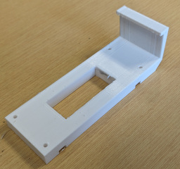
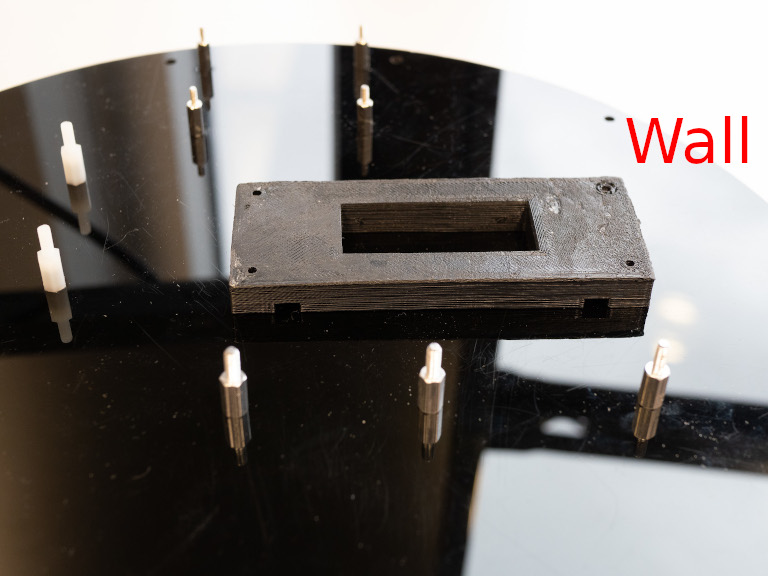
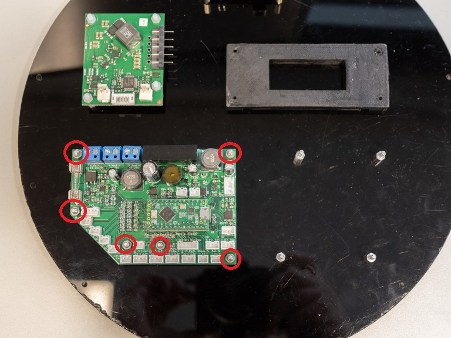

# 5. Base Disk Assembly

## A. Base Disk Pre-Assembly

### Required Parts

| Part                           | Quantity | Image                                                                             |
|--------------------------------| -------- |-----------------------------------------------------------------------------------|
| `Base Disk`                    | 1        |                                           |
| `Battery Holder`               | 1        |                      |
| `M2x10mm Standoff`             | 4        |                          |
| `M2x15mm Standoff`             | 4        |                          |
| `M2x8mm Socket Screw`          | 4        |                          |
| `M3x10mm Standoff`             | 10       |                          |
| `M3x10mm Plastic Standoff`     | 4        |                  |
| `M3x25mm Standoff`             | 4        |                          |
| `M3x5mm Socket Screw`          | 14       |                          |
| `M3 Nuts`                      | 6        |                                             |
| `M3 Plastic Nuts`              | 4        |                             |
| `M3x8mm Plastic Screw`         | 4        |                        |
| `Battery Charger`              | 1        |                     |
| `Adafruit MAX9744`             | 1        |           |
| `PSU Control PCB`              | 1        |                         |
| `12V Buck-Boost PCB`           | 1        |                 |
| `14-cm-Long 16 AWG Red Wire`   | 1        |             |
| `14-cm-Long 16 AWG Black Wire` | 1        |         |
| `8-cm-Long JST VHR-2N Cable`   | 1        |      |

### Steps

1. Install the `M2x10mm standoffs` with `M2x8mm socket screws` onto the `base disk`, as shown in the following pictures.

2. Install the `M3x10mm standoffs` with `M3x5mm socket screws` onto the `base disk`, as shown in the following pictures.

3. Install the `M3x10mm plastic standoffs` with `M3x5mm socket screws` onto the `base disk`, as shown in the following
   pictures.

4. Install the `battery holder` with `M3x8mm plastic screws` onto the `base disk`, as shown in the following pictures.

5. Install the `battery charger` with `M3 plastic nuts`, as shown in the following picture.

6. Install the `Adafruit MAX9744` with `M2x15mm standoffs`, as shown in the following picture.

7. Install the `PSU Control PCB`  with `M3 nuts`, as shown in the following picture.

8. Install the `12V Buck-Boost PCB`  with a `M3 nut` (orange circle) and `M3x25mm standoffs` (red circles), as shown in
   the following picture.

9. Connect the `12V Buck-Boost PCB` input to a `PSU control PCB` output with `14-cm-long 16 AWG wires`, as shown in the
   following picture.

10. Connect the `battery charger` to the `PSU control PCB` with the `8-cm-long JST VHR-2N cable`, as shown in the
    following picture.

