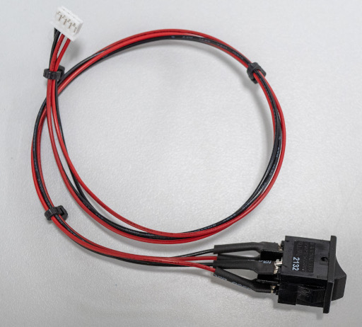
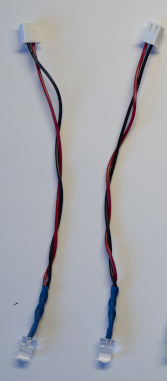
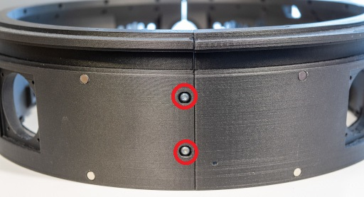

# 6. Audio Base Assembly

## A. Audio Base Pre-Assembly

### Required Parts

| Part                                       | Quantity | Image                                                                                                              |
|--------------------------------------------|----------|--------------------------------------------------------------------------------------------------------------------|
| `Base Audio Front Left`                    | 1        |                                         |
| `Base Audio Front Right`                   | 1        |                                       |
| `Base Audio Back Left`                     | 1        |                                           |
| `Base Audio Back Right`                    | 1        |                                         |
| `Dowel Pin`                                | 2        |                                                                         |
| `Magnet`                                   | 16       |                                                                               |
| `Assembled Speaker`                        | 4        |                                                      |
| `Assembled Fan`                            | 2        |                                                              |
| `Micro USB Connector`                      | 1        |                                                  |
| `Assembled Power Switch`                   | 1        |                                            |
| `Ethernet Connector`                       | 1        |                                                    |
| `Assembled Robot Power Connector - Female` | 1        |          |
| `Assembled LED`                            | 6        |                                                             |
| `M3x8mm Plastic Screw`                     | 22       |                                                        |
| `Fan Screw`                                | 8        |                                                                         |
| `Push button assembly`                     | 4        |                                                                     |
| `Light sensor assembly`                    | 4        |                                                                   |
| `M2x5mm Plastic Screw`                     | 4        |                                                         |

### Steps
1. Install four `magnets` with super glue into the dedicated holes on each of the `base audio front left`, `base audio front right`, `base audio back left`, `base audio back right` parts, as shown in the following pictures.

2. Install dowel pins on `base audio back left` part, as shown in the following picture.

3. Insert the `base audio front left` part into the `base audio front right`, then insert `base audio back left` part into the `base audio back right` to form the full circular base, as shown in the following picture.

4. Put 6 `M3x8 plastic screws` to fix the parts together, as shown in the following pictures.

3. Install the `assembled speakers` with `M3x8 plastic screws`, as shown in the following pictures. The wire lengths are
   shown in the picture.

4. Install the `assembled fans` with `fan screws`, as shown in the following pictures. The wire lengths are shown in the
   picture.

5. Install the `Micro USB connector` as shown in the following picture.

6. Install the `assembled power switch` as shown in the following picture.

7. Install the `assembled robot power connector` with epoxy glue, as shown in the following picture.

8. Install the `push buttons` as shown in the following picture.
> TODO Photo push buttons

9. Install the `light sensors` `with M2x5 plastic screws` as shown in the following picture.
> TODO photo light sensors

## B. Audio Base Assembly

### Required Parts

| Part                                       | Quantity | Image                                                                           |
| ------------------------------------------ | -------- | ------------------------------------------------------------------------------- |
| `Audio Base Pre-Assembly`                  | 1        |                                                                                 |
| `Base Disk Pre-Assembly`                   | 1        |                                                                                 |
| `M3x8mm Plastic Screw`                     | 12       |                      |
| `25-cm-Long 20 AWG Adafruit MAX9744 Wires` | 4        |               |
| `Adafruit MAX9744`                         | 1        |            |
| `M2 Nuts`                                  | 4        |                                           |
| `Assembled JST PHR-6 Cable`                | 1        |                                                                                 |
| `Female Power Connector with Ferrules`     | 1        |       |
| `19V Buck-Boost PCB`                       | 1        |                           |
| `M3 Nuts`                                  | 3        |                                           |
| `8-cm-Long 16 AWG Red Wire`                | 1        |            |
| `8-cm-Long 16 AWG Black Wire`              | 1        |        |
| `Male Power Connector with Ferrules`       | 1        |           |

### Steps

1. Install the `base disk pre-assembly` onto the `audio base pre-assembly` with `M3x8mm plastic screws` (red circles), as shown in the following picture.

> TODO CHANGE IMAGE

9. Install the `assembled white LEDs` with epoxy glue, as shown in the following picture.
> TODO CHANGE PHOTO

2. Glue white the `LEDs` as shown in the following picture.
> TODO PHOTO white leds

10. Install the  `RGB strips` and use the underneath adhesive to stick with the base as shown in the following picture:

> TODO PHOTO LED RGB
>

7. Install the `Ethernet connector` as shown in the following picture.
> TODO PHOTO ethernet connector

3. Connect the `fans` as shown in the following picture.

4. Connect the bush buttons as show in the following picture. Make sure each button is connected to the right place.

5. Connect the `power switch` as shown in the following picture.
> TODO PHOTO

6. Connect the `light sensors`as shown in the following picture. Make sure you connect the front, left, back, right sensor at the right place.
> TODO PHOTO

1. Connect the `assembled robot power connector` as shown in the following picture.

6. Connect 2 `24-cm long 20 AWG Adafruit MAX9744 wires` to the `12V Buck-Boost PCB`, as shown in the following picture.

7. Connect those wires to the `Adafruit MAX9744`, as shown in the following picture.

8. Connect the `farthest speakers` to the `Adafruit MAX9744`, as shown in the following picture.

9. Install the second `Adafruit MAX9744` onto the top of the first one with `M2 nuts`, as shown in the following
   picture.

10. Connect 2 `24-cm long 20 AWG Adafruit MAX9744 wires` to the `12V Buck-Boost PCB`, as shown in the following picture.

11. Connect those wires to the second `Adafruit MAX9744`, as shown in the following picture.

12. Connect the `nearest speakers` to the second `Adafruit MAX9744`, as shown in the following picture.

13. Connect the `PSU control PCB` to the `battery charger` with the `assembled JST PHR-6 cable`, as shown in the
    following picture.

14. Connect the `female power connector with ferrules` to a `12V Buck-Boost PCB` output, as shown in the following
    picture.

15. Install the `19V Buck-Boost PCB`  with `M3 nuts` (orange circle), as shown in the following picture.

16. Connect the `19V Buck-Boost PCB` input to a `PSU control PCB` output with `8-cm-long 16 AWG wires`, as shown in the
    following picture.

17. Connect the `male power connector with ferrules` to a `19V Buck-Boost PCB` output, as shown in the following
    picture.

## C. Setup the Battery Charger

### Required Parts

| Part                     | Quantity | Image                                                          |
| ------------------------ | -------- | -------------------------------------------------------------- |
| `Micro USB Cable`        | 1        |                                                                |
| `19V Power Adapter`      | 1        |                                                                |

### Steps

1. Open the [project](../../firmwares/psu_control) in PlatformIO.
2. Change the value `FIRMWARE_MODE` in [config.h](../../firmwares/psu_controlinclude/config.h)
   to `FIRMWARE_MODE_SETUP_BATTERY_CHARGER`.
3. Make sure the battery is removed.
4. Connect the micro USB cable to the computer and the Teensy LC.
5. Turn off the robot.
6. Connect the `19V Power Adapter` to the base.
7. Turn on the robot.
8. Click on the upload button.

## D. Finish the Audio Base Assembly

### Required Parts

| Part                         | Quantity | Image                                                                                  |
| ---------------------------- | -------- | -------------------------------------------------------------------------------------- |
| `Battery - RRC2054-2`        | 1        |                                |
| `Ground Loop Noise Isolator` | 2        |        |

### Steps

1. Install the `battery` and the `ground loop noise isolators` with tie wraps, as shown in the following picture.

2. Connect the `ground loop noise isolators` to the `Adafruit MAX9744`.

3. Connect the `Adafruit MAX9744 I2C cables` to the `PSU control PCB`, as shown in the following picture.

4. Connect the `micro USB connector` to the `PSU control PCB`, as shown in the following picture.

