# 7. Mic Base Assembly

## A. Microphone Gain Increase

### Required Parts

| Part                     | Quantity | Image                                                            |
| ------------------------ | -------- | ---------------------------------------------------------------- |
| `16SoundsUSB`            | 1        | 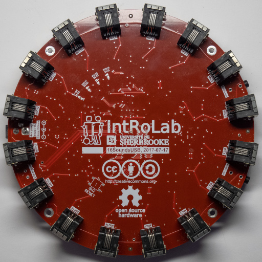               |
| `xSoundsMicrophones`     | 16       | 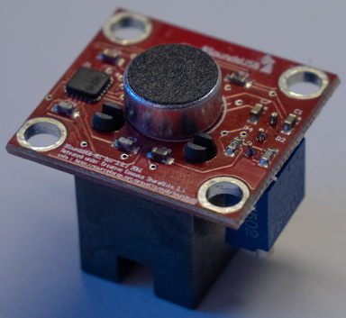     |
| `16SoundsUSB Cable`      | 16       | 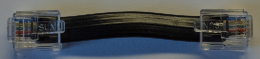   |
| `Mini USB Cable`         | 1        |                                                                  |
| `Computer`               | 1        |                                                                  |

### Steps

1. Install Audacity on the computer.
2. Connect all `xSoundsMicrophones` to the `16SoundsUSB` with `16SoundsUSB cables`.
3. Connect the `16SoundsUSB` to the computer with the `mini USB cable`.
4. Open Audacity.
5. Start the recording with the `16SoundsUSB`.
6. For each `xSoundsMicrophones`, turn the potentiometer counterclockwise to increase the gain until the sound level is
   stable.

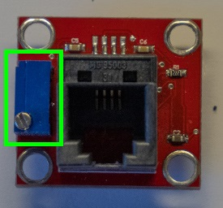

## B. Mic Base Pre-Assembly

### Required Parts

| Part                     | Quantity | Image                                                          |
| ------------------------ | -------- | -------------------------------------------------------------- |
| `Base Mic`               | 4        | 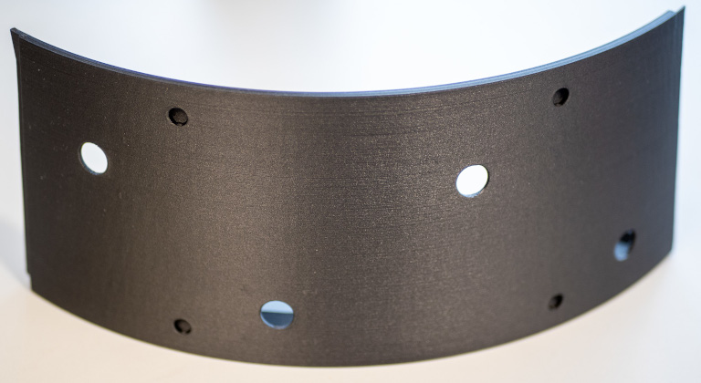              |
| `Magnet`                 | 16       | 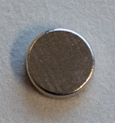                          |
| `xSoundsMicrophones`     | 16       |    |
| `M3x5mm Plastic Screw`   | 64       | 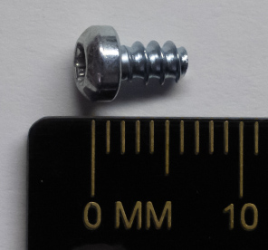    |

### Steps
1. Install four `magnets` with super glue into the dedicated holes on each of the `base mic`, as shown in the following picture.

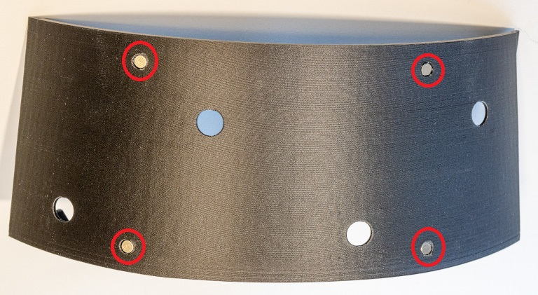

2. For each `base mic` part, use `M3x5mm plastic screws` to install 4 `xSoundsMicrophones`, as shown in
   the following picture.

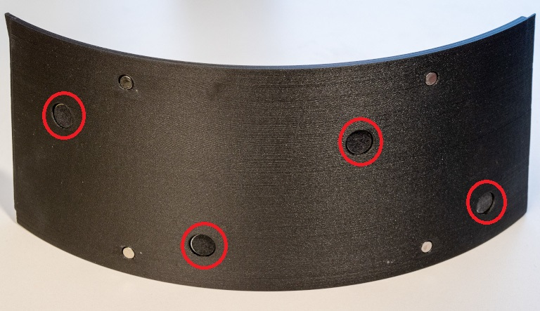
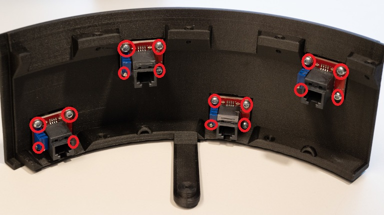

## C. Mic Base Assembly

### Required Parts

| Part                     | Quantity | Image                                                           |
| ------------------------ | -------- | --------------------------------------------------------------- |
| `Audio Base Assembly`    | 1        |                                                                 |
| `Mic Base Pre-Assembly`  | 4        |                                                                 |
| `M3x12mm Plastic Screw`  | 8        | 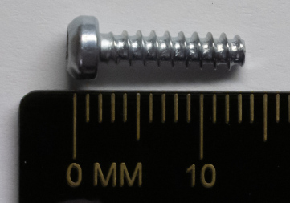   |

### Steps

1. Install `mic base pre-assemblies` onto the `audio base assembly` with `M3x12mm plastic screws`, as shown in the
   following picture.

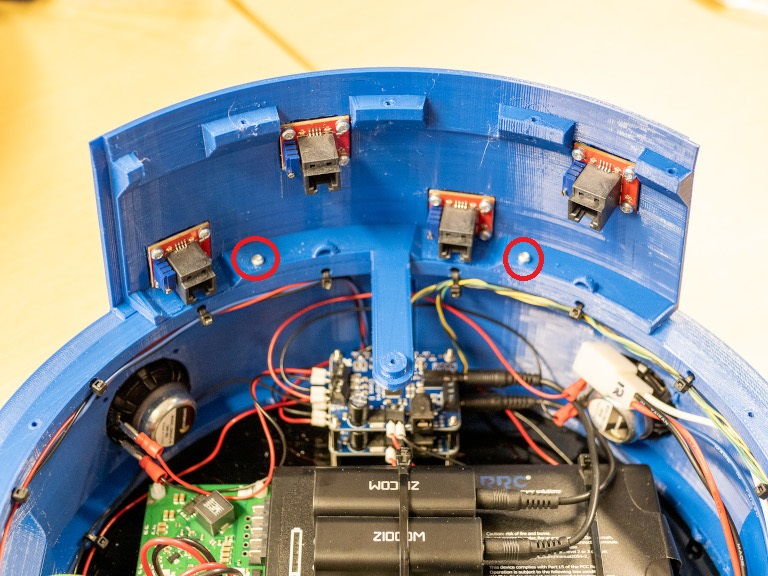
