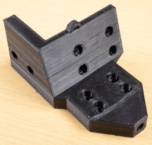
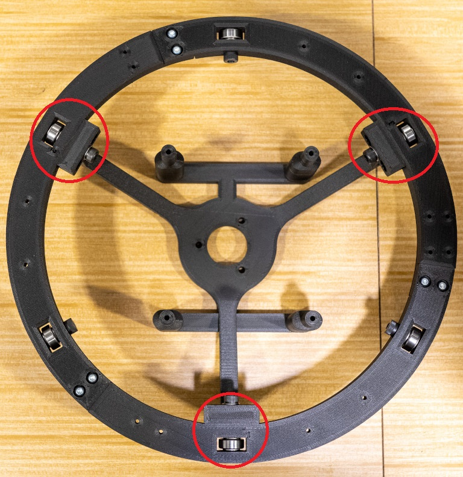
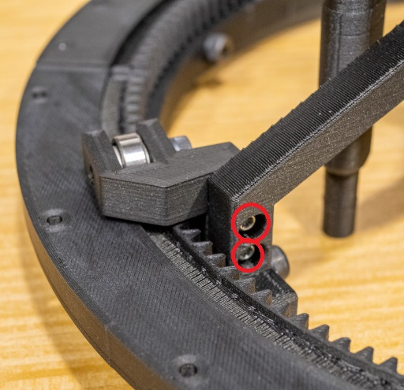
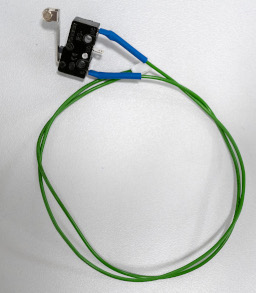
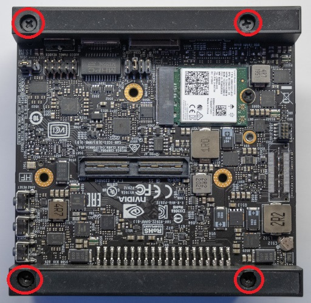
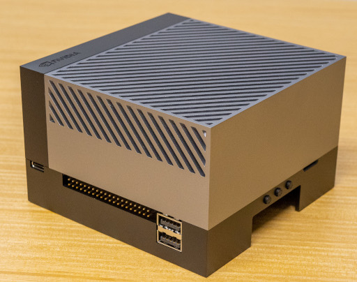

# 8. Torso Bottom Assembly

## A. Dynamixel Pre-Assembly

### Required Parts

| Part                                 | Quantity | Image                                                                                      |
| ------------------------------------ | -------- | ------------------------------------------------------------------------------------------ |
| `Dynamixel XL430-W250-T (ID7)`       | 1        |                          |
| `Torso Bottom Gear`                  | 1        |                         |
| `M2x12mm Socket Screw`               | 4        |                                 |

### Steps

1. Install the `torso bottom gear` onto the `Dynamixel XL430-W250-T` with the `M2x12mm socket screws`, as shown in the
   following picture.

## B. Torso Bottom Holder

### Required Parts

| Part                  | Quantity | Image                                                                     |
| --------------------- | -------- | ------------------------------------------------------------------------- |
| `Torso Bottom Holder` | 3        |    |
| `605zz`               | 3        |                                        |
| `M5x16 Socket Screw`  | 3        |                  |
| `M5 Washer`           | 6        |                                |

### Steps

1. Place a `M5 washer` on either side of a `605zz` bearing.
2. Install the `605zz` bearing and the `M5 washers` into the `torso bottom holder` with a `M5x16mm socket screw`, as
   shown in the following picture.

2. Repeat steps 1 to 2 for the remaining parts.

## C. Torso Bottom - 3D Printed Parts

### Required Parts

| Part                                                           | Quantity | Image                                                                                   |
| -------------------------------------------------------------- | -------- | --------------------------------------------------------------------------------------- |
| `Torso Bottom External 1`                                      | 1        |          |
| `Torso Bottom External 2`                                      | 1        |          |
| `Torso Bottom External 3`                                      | 1        |          |
| `Torso Bottom Internal Xavier` or `Torso Bottom Internal Orin` | 1        |  or    |
| `Base Gear 1`                                                  | 1        |                                    |
| `Base Gear 2`                                                  | 1        |                                    |
| `Base Gear 3`                                                  | 1        |                                    |
| `Base Gear 4`                                                  | 1        |                                    |
| `Assembled Torso Bottom Holder`                                | 3        |           |
| `Limit Switch Bracket`                                         | 1        |                |
| `Torso Bottom Magnet Bracket`                                  | 1        |  |
| `Gear Servo Bracket`                                           | 1        |                    |
| `605zz`                                                        | 6        |                                                      |
| `M3x6 Plastic Screw`                                           | 10       |                                |
| `M5x16 Socket Screw`                                           | 3        |                                |
| `M5x30 Socket Screw`                                           | 3        |                                |
| `M5x16 Washer`                                                 | 15       |                                           |
| `M3x12 Plastic Screw`                                          | 12       |                              |

### Steps

1. Install the `torso bottom external` parts together with the `M3x6 plastic screws`, as shown in the first following picture. Sand the part if needed.

2. Install the `base gear` parts together with the `M3x6 plastic screws`, as shown in the first following picture. Sand the part if needed.

3. Install a `magnet` with super glue into the dedicated hole of the `limit switch bracket`, as shown in the following picture.

4. Install a `magnet` with super glue into the dedicated hole of the `torso bottom magnet bracket`, as shown in the following picture.

5. Install a `magnet` with super glue into the dedicated hole of the `gear servo bracket`, as shown in the following picture.

6. Place the `assembled torso bottom external` and the `torso bottom internal`, as shown in the first following picture. Make
   sure the small holes in the `assembled torso bottom external` are aligned with the `torso bottom internal`. The holes for
   screws holding the `605zz` bearings must be closer to the bottom (`slip ring` hole), as shown in the second following
   picture.

7. Put 6 `M3x12 plastic screws` to fix the parts together (2 screws per branch).

8. Place a `M5 washer` on either side of a `605zz` bearing.
9. Install the `605zz` bearing and the `M5 washers` into a hole between the branches with a `M5x16mm socket screw`, as
   shown in the following picture.

10. Repeat steps 3 to 4 for all holes between the branches.

11. Put a `M5 washer` onto a `M5x30 socket screw`.

12. Place a `M5 washer` on either side of a `605zz` bearing.
13. Install the `605zz` bearing and the `M5 washers` into a hole aligned with the branches with a `M5x30mm socket screw`,
   as shown in the following picture.

14. Repeat steps 6 to 8 for all holes aligned with the branches.

15. Flip the assembly.
16. Install the `assembled base gear` as shown in the following picture.

17. Install all `assembled torso bottom holders` with `M3x12 plastic screws`.

18. Install the `limit switch bracket` with `M3x12 plastic screws`.

19. Install the `torso bottom magnet bracket` with `M3x12 plastic screws`.

20. Install the `gear servo bracket` with `M3x12 plastic screws`.

## D. Torso Bottom - Antennas - Jetson AGX Xavier

### Required Parts

| Part                                  | Quantity | Image                                                            |
| ------------------------------------- | -------- | ---------------------------------------------------------------- |
| `Stewart Stand`                       | 2        |       |
| `WiFi Antenna`                        | 2        |              |

### Steps

1. Install a `WiFi antenna` to a `Stewart stand`, as shown in the following picture.

2. Install the other `WiFi antenna` to the other `Stewart stand`, as shown in the following picture.

## E. Torso Bottom - Electronics - Jetson AGX Xavier

### Required Parts

| Part                                  | Quantity | Image                                                                                        |
| ------------------------------------- | -------- | -------------------------------------------------------------------------------------------- |
| `Nvidia Jetson AGX Xavier`            | 1        |                         |
| `Stewart Stand With An Antenna`       | 2        |                                              |
| `Stewart Stand`                       | 1        |                                   |
| `Assembled Torso Bottom Dynamixel`    | 1        |                  |
| `Assembled Limit Switch`              | 1        |                      |
| `M3x55 Socket Screw`                  | 4        |                                     |
| `M3x12 Plastic Screw`                 | 6        |                                   |
| `M2.5x8 Plastic Screw`                | 6        |                                 |
| `M2.5x12 Plastic Screw`               | 2        |                               |
| `Magnet`                              | 3        |                                                         |

### Steps

1. Install a `magnet` with super glue into the dedicated hole of each `Stewart stand`, as shown in the following picture.

2. Remove the following screws.

3. Install the `Nvidia Jetson AGX Xavier` onto the assembly with `M3x55 socket screws`.

4. Install the `assembled torso bottom dynamixel` onto the assembly with `M2.5x8 plastic screws`, as shown in the following pictures.

5. Install the `stewart stand` onto the assembly with `M3x12 plastic screws`, as shown in the following pictures.

6. Install the first `stewart stand with an antenna` onto the assembly with `M3x12 plastic screws`, as shown in the following pictures.

7. Install the second `stewart stand with an antenna` onto the assembly with `M3x12 plastic screws`, as shown in the following pictures.

8. Install the `assembled limit switch` onto the assembly with `M2.5x12 plastic screws`.

9. Connect the `WiFi antennas` to the `WiFi card`.

## E. Torso Bottom - Electronics - Jetson AGX Orin

### Required Parts

| Part                                  | Quantity | Image                                                                                        |
| ------------------------------------- | -------- | -------------------------------------------------------------------------------------------- |
| `Nvidia Jetson AGX Orin`              | 1        |                             |
| `RTC Clock Battery`                   | 1        |                                          |
| `Stewart Stand`                       | 3        |                                   |
| `Assembled Torso Bottom Dynamixel`    | 1        |                  |
| `Assembled Limit Switch`              | 1        |                      |
| `M3x12 Plastic Screw`                 | 6        |                                   |
| `M2.5x8 Plastic Screw`                | 6        |                                 |
| `M2.5x12 Plastic Screw`               | 2        |                               |
| `Magnet`                              | 3        |                                                         |

### Steps

1. Install the `RTC clock battery` as shown in the following picture.

2. Install a `magnet` with super glue into the dedicated hole of each `Stewart stand`, as shown in the following picture.

3. Remove the following screws.

4. Remove the stand.

5. Install the `Nvidia Jetson AGX Orin` onto the assembly with removed screws, as shown in the following picture.

6. Install the `assembled torso bottom dynamixel` onto the assembly with `M2.5x8 plastic screws`, as shown in the following pictures.

7. Install the `stewart stands` onto the assembly, as shown in the following picture.

8. Install the `assembled limit switch` onto the assembly with `M2.5x12 plastic screws`.

