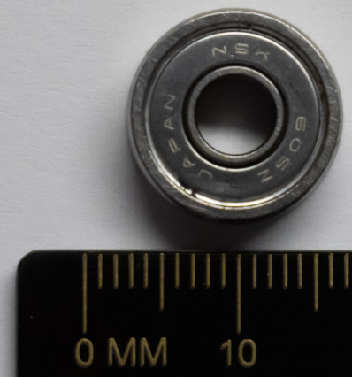

# 8. Torso Bottom Assembly

## A. Dynamixel Pre-Assembly
### Required Parts
| Part                                 | Quantity | Image                                                                                      |
| ------------------------------------ | -------- | ------------------------------------------------------------------------------------------ |
| `Dynamixel XL430-W250-T (ID7)`       | 1        |                        |
| `Dynamixel Cable`                    | 1        |                                |
| `Dynamixel XL430-W250-T Cable Cover` | 1        |  |
| `Dynamixel XL430-W250-T Screw`       | 1        |                      |
| `Torso Bottom Gear`                  | 1        |             |
| `M2x12mm Socket Screw`               | 4        |                               |

### Steps
1. Install the `Dynamixel XL430-W250-T screw` as shown in the following picture.

2. Install the `torso bottom gear` onto the `Dynamixel XL430-W250-T` with the `M2x12mm socket screws`, as shown in the following picture.

3. Connect the `Dynamixel cable` into the `Dynamixel XL430-W250-T`.
4. Install the `Dynamixel XL430-W250-T cable cover` as shown in the following picture.

## B. Torso Bottom Holder
### Required Parts
| Part                  | Quantity | Image                                                                           |
| --------------------- | -------- | ------------------------------------------------------------------------------- |
| `Torso Bottom Holder` | 3        |  |
| `605zz`               | 3        |                                              |
| `M5x16 Socket Screw`  | 3        |                      |
| `M5 Washer`           | 6        |                                    |

### Steps
1. Place a `M5 washer` on either side of a `605zz` bearing.
2. Install the `605zz` bearing and the `M5 washers` into the `torso bottom holder` with a `M5x16mm socket screw`, as shown in the following picture.

2. Repeat steps 1 to 2 for the remaining parts.

## C. Torso Bottom - 3D Printed Parts
### Required Parts
| Part                                  | Quantity | Image                                                                                   |
| ------------------------------------- | -------- | --------------------------------------------------------------------------------------- |
| `Torso Bottom (External)`             | 1        | .jpg) |
| `Torso Bottom (Internal)`             | 1        | .jpg) |
| `Base Gear`                           | 1        |                                |
| `Assembled Torso Bottom Holder`       | 1        |    |
| `Limit Switch Support`                | 1        |        |
| `Gear Servo Support`                  | 1        |            |
| `605zz`                               | 6        |                                                      |
| `M5x16 Socket Screw`                  | 3        |                              |
| `M5x30 Socket Screw`                  | 3        |                              |
| `M5x16 Washer`                        | 15       |                                         |
| `M3x12 Plastic Screw`                 | 12       |                            |

### Steps
1. Place the `torso bottom (external)` and the `torso bottom (internal)`, as shown in the first following picture. Make sure the small holes in the `torso bottom (external)` are aligned with the `Jetson AGX Xavier` support. The holes for screws holding the `605zz` bearings must be closer to the bottom (`slip ring` hole), as shown in the second following picture.

2. Put 6 `M3x12 plastic screws` to fix the parts together (2 screws per branch).

3. Place a `M5 washer` on either side of a `605zz` bearing.
4. Install the `605zz` bearing and the `M5 washers` into a hole between the branches with a `M5x16mm socket screw`, as shown in the following picture.

5. Repeat steps 3 to 4 for all holes between the branches.

6. Put a `M5 washer` onto a `M5x30 socket screw`.

7. Place a `M5 washer` on either side of a `605zz` bearing.
8. Install the `605zz` bearing and the `M5 washers` into a hole aligned with the branches with a `M5x16mm socket screw`, as shown in the following picture.

9. Repeat steps 6 to 8 for all holes aligned with the branches.

10. Flip the assembly.
11. Install the `base gear` as shown in the following picture.

12. Install all `assembled torso bottom holders` with `M3x12 plastic screws`.

13. Install the `limit switch support` with `M3x12 plastic screws`.

14. Install the `gear servo support` with `M3x12 plastic screws`.

## D. Torso Bottom - Antennas
### Required Parts
| Part                                  | Quantity | Image                                                                                   |
| ------------------------------------- | -------- | --------------------------------------------------------------------------------------- |
| `Stewart Support`                     | 2        |                    |
| `WiFi Antenna`                        | 2        |                                   |

### Steps
1. Install a `WiFi antenna` to a `Stewart support`, as shown in the following picture.

2. Install the other `WiFi antenna` to the other `Stewart support`, as shown in the following picture.

## E. Torso Bottom - Electronics
### Required Parts
| Part                                  | Quantity | Image                                                                                        |
| ------------------------------------- | -------- | -------------------------------------------------------------------------------------------- |
| `Nvidia Jetson AGX Xavier`            | 1        |                     |
| `WiFi Card`                           | 1        |                                              |
| `Stewart Support With An Antenna`     | 2        |                                         |
| `Stewart Support`                     | 1        |                         |
| `Assembled Torso Bottom Dynamixel`    | 1        |             |
| `Assembled Limit Switch`              | 1        |  |
| `M3x55 Socket Screw`                  | 4        |                                   |
| `M3x12 Plastic Screw`                 | 6        |                                 |
| `M2.5x8 Plastic Screw`                | 6        |                               |
| `M2.5x12 Plastic Screw`               | 2        |                             |

### Steps
1. Install the `WiFi card` into the `Nvidia Jetson AGX Xavier`.

2. Remove the following screws.

3. Install the `Nvidia Jetson AGX Xavier` onto the assembly with `M3x55 socket screws`.

4. Install the `assembled torso bottom dynamixel` onto the assembly with `M2.5x8 plastic screws`.

5. Install the `stewart support` onto the assembly.

6. Install the first `stewart support with an antenna` onto the assembly.

7. Install the second `stewart support with an antenna` onto the assembly.

8. Install the `assembled limit switch` onto the assembly with `M2.5x12 plastic screws`.

9. Connect the `WiFi antennas` to the `WiFi card`.

