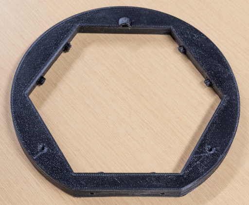
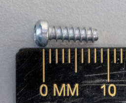

# 9. Stewart Platform Assembly

## A. Dynamixel Centering

### Required Parts

| Part                                             | Quantity | Image                                                          |
| ------------------------------------------------ | -------- | ---------------------------------------------------------------|
| `Dynamixel XL430-W250-T (ID 1, 2 3, 4, 5 and 6)` | 6        |  |
| `OpenCR`                                         | 1        |                        |
| `Dynamixel Cable`                                | 1        |      |
| `Micro USB Cable`                                | 1        |                                                                |
| `12V Power Supply`                               | 1        |                                                                |
| `Computer`                                       | 1        |                                                                |

### Steps

1. Open the [project](../../firmwares/dynamixel_centering/) in PlatformIO.
2. Connect the `Dynamixel control PCB` to the computer with the `micro USB cable`.
3. Connect the `Dynamixel control PCB` and a `Dynamixel XL430-W250-T` with the `Dynamixel cable`.
4. Connect the `12V power supply` to the `Dynamixel control PCB`.
5. Change the value of `MOTOR_ID` according to the current `Dynamixel XL430-W250-T.
6. Program the `Dynamixel control PCB`.
7. Open the serial monitor.
8. Wait until the `Dynamixel XL430-W250-T` is centered.
9. Repeat steps 3 to 8 for each `Dynamixel XL430-W250-T`.

## B. Dynamixel Pre-Assembly

### Required Parts

| Part                                           | Quantity | Image                                                                             |
| ---------------------------------------------- | -------- | --------------------------------------------------------------------------------- |
| `Dynamixel XL430-W250-T (ID 1, 2, 3, 4 and 5)` | 6        |                 |
| `Stewart Horn Left M2.5`                       | 2        |      |
| `Stewart Horn Left M3`                         | 2        |          |
| `Stewart Horn Right M2.5`                      | 2        |    |
| `Stewart Horn Right M3`                        | 2        |        |
| `M2x12mm Socket Screw`                         | 24       |                        |

### Steps

1. Install a `stewart horn left M2.5` onto each `Dynamixel XL430-W250-T with the ID 2 and 6` with the `M2x12mm socket screws`, as shown in
   the following picture.

2. Install the `stewart horn left M3` onto the `Dynamixel XL430-W250-T with the ID 4` with the `M2x12mm socket screws`, as shown in
   the following picture.

3. Install a `stewart horn right M2.5` onto each `Dynamixel XL430-W250-T with the ID 1 and 5` with the `M2x12mm socket screws`, as shown in
   the following picture.

4. Install the `stewart horn right M3` onto the `Dynamixel XL430-W250-T with the ID 3` with the `M2x12mm socket screws`, as shown in
   the following picture.

## C. Stewart Platform Rod Pre-Assembly

### Required Parts

| Part                           | Quantity | Image                                                              |
| ------------------------------ | -------- | ------------------------------------------------------------------ |
| `Ball Joint - M3xL20mm Silver` | 12       |     |
| `Threaded Rod - M3x170mm`      | 6        |         |

### Steps

1. Apply threadlocker to the ends of a `threaded rod`.
2. Screw a ball joint to each ends of the `threaded rod` until the distance between the centers of the ball joint holes
   is 191 mm.
3. Repeat steps 1 to 2 for each `threaded rod`.

## D. Stewart Platform

### Required Parts

| Part                                                       | Quantity | Image                                                                                      |
| ---------------------------------------------------------- | -------- | ------------------------------------------------------------------------------------------ |
| `Stewart Bottom 1`                                         | 1        |                           |
| `Stewart Bottom 2`                                         | 1        |                           |
| `Stewart Bottom 3`                                         | 1        |                           |
| `Stewart Top`                                              | 1        |                                     |
| `USB Hub Stand`                                            | 4        |                               |
| `Assembled Dynamixel XL430-W250-T (ID 1, 2 3, 4, 5 and 6)` | 6        |     |
| `Dynamixel Cable`                                          | 7        |                                  |
| `Dynamixel XL430-W250-T Cable Cover`                       | 6        |      |
| `Dynamixel Control PCB`                                    | 1        |                      |
| `Assembled Stewart Platform Rod`                           | 6        |                                       |
| `USB Hub`                                                  | 2        |                                                  |
| `M3x6 Plastic Screw`                                       | 6        |                                   |
| `M2.5x8 Plastic Screw`                                     | 46       |                               |
| `M2.5x12 Plastic Screw`                                    | 4        |                             |
| `M3x8 Plastic Screw`                                       | 4        |                                   |
| `M3x12 Plastic Screw`                                      | 14       |                                 |
| `Big Spring`                                               | 2        |                                               |
| `Small Spring`                                             | 4        |                                           |

### Steps

1. Install the `Stewart bottom` parts together with the `M3x6 plastic screws`, as shown in the first following picture. Sand the part if needed.

2. Place the `Assembled Dynamixel XL430-W250-T with the ID 1` under the `Stewart bottom`, according to the following
   picture.

3. Install the `Assembled Dynamixel XL430-W250-T with the ID 1` with `M2.5x8 plastic screws`.

4. Repeat steps 2 to 3 for the other `Assembled Dynamixel XL430-W250-T`.

5. Install a `M3x8 plastic screw` into the horn of the `Assembled Dynamixel XL430-W250-T with the ID 3`, as as shown in the following picture.

6. Install a  `M3x12 plastic screw` into the Stewart Bottom near the `Assembled Dynamixel XL430-W250-T with the ID 3`, as as shown in the following picture.

7. Install a `big spring` as as shown in the following picture.

8. Repeat steps 5 to 7 for the`Assembled Dynamixel XL430-W250-T with the ID 4`.

9. Install a `M2.5x8 plastic screw` and a `small spring` into the horn of the `Assembled Dynamixel XL430-W250-T with the ID 5`, as as shown in the following picture.

10. Install a `M2.5x12 plastic screw` and the `small spring` into the Stewart Bottom near the `Assembled Dynamixel XL430-W250-T with the ID 5`, as as shown in the following picture.

11. Repeat steps 9 to 10 for the`Assembled Dynamixel XL430-W250-T with the ID 1, 2 and 6`.

12. Connect the `Dynamixel with the ID 3` and the `Dynamixel with the ID 4` together with a `Dynamixel cable`.
13. Connect the `Dynamixel with the ID 4` and the `Dynamixel with the ID 5` together with a `Dynamixel cable`.
14. Connect the `Dynamixel with the ID 2` and the `Dynamixel with the ID 1` together with a `Dynamixel cable`.
15. Connect the `Dynamixel with the ID 1` and the `Dynamixel with the ID 6` together with a `Dynamixel cable`.
16. Connect a `Dynamixel cable` into the `Dynamixel with the ID 5`.
17. Connect a `Dynamixel cable` into the `Dynamixel with the ID 6`.
18. Connect a `Dynamixel cable` into the `Dynamixel with the ID 3`.
19. Install the `Dynamixel XL430-W250-T cable covers` onto all `Dynamixel`.
20. Install the `USB hub stands` with `M3x12 plastic screws`, as shown in the following picture.

21. Connect the `Dynamixel cable` of the `Dynamixel with the ID 5` to the `Dynamixel Control PCB`.
22. Connect the `Dynamixel cable` of the `Dynamixel with the ID 6` to the `Dynamixel Control PCB`.
23. Install the `Dynamixel Control PCB` with `M3x8 plastic screws`, as shown in the following picture.

24. Install tie wraps to hold the cables, as shown in the following picture.

25. Install an `assembled Stewart platform rod` onto each `Stewart horn` with a `M3x12 plastic screw`, as shown in the
    following picture.

26. Align the top `ball joints` with the nearest red line, as shown in the following picture.

27. Install the `Stewart top` onto the top `ball joints` with `M3x12 plastic screws`, as shown in the following
    pictures.

28. Install the `USB hubs` with tie wraps, as shown in the following picture.

