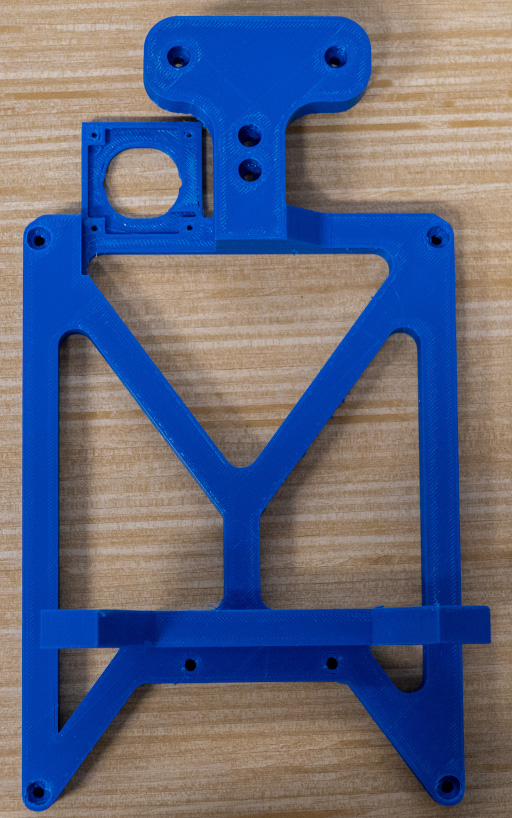
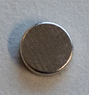

# 10. Head Assembly

## A. Parts Pre-Assembly

### Required Parts

| Part                                         | Quantity | Image                                                                      |
| -------------------------------------------- | -------- | -------------------------------------------------------------------------- |
| `HDMI Cable`                                 | 1        |                            |
| `270-Degree HDMI Adapter`                    | 1        |             |
| `Touchscreen`                                | 1        |                               |
| `M3x5mm Screw Included with the Touchscreen` | 4        |                          |
| `Spacer Included with the Touchscreen`       | 4        |                                |
| `Intel RealSense D435i`                      | 1        |      |
| `Wide Angle Camera`                          | 1        |              |
| `Wide Angle Camera Lens`                     | 1        |    |

### Steps

1. Connect a `270-degree HDMI adapter` to one end of the `HDMI cable`, as shown in the following picture.

2. Install the `spacers` onto the `touchscreen`, as shown in the following pictures.

3. Turn on the `touchscreen` as shown in the following picture.

4. Remove the USB-C protector from the `Intel RealSense D435i`, as shown in the following picture.

5. Remove the `lens` of the `wide angle camera`.
6. Install the `wide angle camera lens` onto the `wide angle camera`.
7. Connect the provided USB cable to the `wide angle camera`.
8. Set the focus of the `wide angle camera` to infinity.

## B. Head

### Required Parts

| Part                                                  | Quantity | Image                                                                              |
| ----------------------------------------------------- | -------- | ---------------------------------------------------------------------------------- |
| `Head`                                                | 1        |                                           |
| `Head Cable Protector`                                | 1        |           |
| `Assembled Touchscreen`                               | 1        |                           |
| `Intel RealSense D435i`                               | 1        |                  |
| `HDMI Cable (1.5 ft)`                                 | 1        |                                  |
| `Micro-USB Cable - Right Angle`                       | 1        |      |
| `USB-C Cable Included with the Intel RealSense D435i` | 1        |                                                                                    |
| `90-Degree USB-C Adapter`                             | 1        |                    |
| `M3x12 Plastic Screw`                                 | 10       |                         |
| `M3x10mm Socket Screw`                                | 6        |                         |
| `Magnet`                                              | 8        |                                               |

### Steps

1. Install the `head` onto the `Stewart top` with `M3x12 plastic screws`, as shown in the following pictures.

2. Install the `touchscreen` onto the `head` with `M3x10mm socket screws`, as shown in the following pictures.

3. Connect the `HDMI cable` to the `touchscreen`.
4. Connect the `micro-USB cable` to the `touchscreen`, as shown in the following picture.

5. Install a `magnet` with super glue into the dedicated hole of the `head cable protector`, as shown in the following pictures.

6. Install the `Intel RealSense D435i` onto the `head` with `M3x10mm socket screws`, as shown in the following picture.

7. Install the `wide angle camera` onto the `head` with `M2.5x5 plastic screws`, as shown in the following picture.

8. Install the `head cable protector` onto the `head` with `M3x12 plastic screws`, as shown in the following pictures.

9. Connect the `90-degree USB-C adapter` to the `Intel RealSense D435i`.
10. Connect the `USB-C cable` to the `90-degree USB-C adapter`.
11. Roll the USB cables to the `Stewart top`, attach them with a tie wrap and connect them to a `USB hub`.
