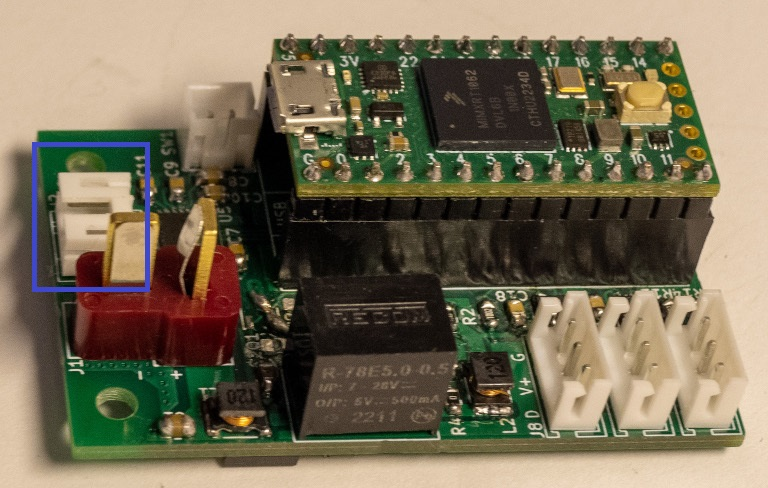

# 11. Robot Assembly

## A. Base/Torso Bottom Assembly

### Required Parts

| Part                                | Quantity | Image                                                                                 |
| ----------------------------------- | -------- | ------------------------------------------------------------------------------------- |
| `Base Assembly`                     | 1        |                                                                                       |
| `Assembled Slip Ring`               | 1        |                                                                                       |
| `1/8-Inch Stereo Jack Cable`        | 2        |                                                                                       |
| `16SoundsUSB`                       | 1        |                                     |
| `M3x8mm Plastic Screw`              | 4        |                            |
| `16SoundsUSB Cable`                 | 16       |               |
| `Torso Bottom Assembly`             | 1        |                                                                                       |
| `M5x10mm Plastic Screw`             | 3        |                          |
| `M3x12mm Plastic Screw`             | 16       |                          |
| `Computer Power Connector`          | 1        |         |
| `Dynamixel Control Power Connector` | 1        |  |

### Steps

1. Connect the bottom `Ethernet connector` of the `assembled slip sing` to the base connector.
2. Connect the bottom `power connectors` of the `assembled slip sing` to `power connectors` connected
   the `Buck-Boost PCBs`.
3. Connect the `JST PH connector` of the `assembled slip sing` to the following connector of the `PSU Control PCB`.

4. Connect the `1/8-Inch stereo jack cables` to the `ground loop noise isolators`.
5. Connect the `1/8-Inch stereo jack cables` to the `16SoundsUSB`.
6. Connect the `Mini-USB cable` to the `16SoundsUSB`.
7. Install the `16SoundsUSB` into the base with `M3x8mm plastic screws`, as shown in the following picture.

8. Install the `assembled slip ring` into the `torso bottom assembly` with `M5x10mm plastic screws`, as shown in the
   following picture.

9. Connect all `16SoundsUSB cables`.

10. Install the `torso bottom assembly` onto the base with `M3x12mm plastic screws`, as shown in the following picture.

11. Connect the `computer power connector` to the top `power connector` of the `assembled slip sing`.
12. Connect the `Dynamixel control power connector` to the top `power connector` of the `assembled slip sing`.
13. Connect the `computer power connector` and the the `Ethernet connector` to the `Nvidia Jetson AGX Xavier` or `Nvidia Jetson AGX Orin`.
14. Secure the wires with tie wraps.

## B. Torso Bottom/Stewart Platform Assembly

### Required Parts

| Part                                            | Quantity | Image                                                             |
| ----------------------------------------------- | -------- | ------------------------------------------------------------------|
| `Torso Bottom Assembly`                         | 1        |                                                                   |
| `Stewart Platform Assembly`                     | 1        |                                                                   |
| `M3x12mm Plastic Screw`                         | 6        |      |
| `Micro-USB Cable Included with the Touchscreen` | 1        |  |

### Steps

1. Place the `Stewart platform assembly` onto the `torso bottom assembly` without installing the screws, as shown in the
   following picture.

2. Connect the `Dynamixel control power connector` to the `Dynamixel control PCB` (the cable must pass through the `Stewart bottom` hole).
3. Connect the `limit switch connector` to the following connector of the `Dynamixel control PCB` (the cable must pass through the `Stewart bottom` hole).

4. Connect the `slip ring JST PH connector` to the following connector of the `Dynamixel control PCB` (the cable must pass through the `Stewart bottom` hole).

5. Connect the `Micro-USB cable included with the touchscreen` to the `Dynamixel control PCB` and a `USB hub`.
6. Connect the `USB hubs` to `Nvidia Jetson AGX Xavier` (the cables must pass through the `Stewart bottom` hole).
7. Connect the `HDMI cable` with a `270-Degree HDMI adapter` or with `Display port adapters` to `Nvidia Jetson AGX Xavier` or `Nvidia Jetson AGX Orin` (the cable must pass through the `Stewart bottom` hole).
8. Install the `M3x12mm plastic screws` to fix the `Stewart platform assembly` onto the `torso bottom assembly`.
