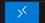

# Getting Started

This is a guide to help you get started with the project. It covers the basic setup, configuration, and usage of the project.
It is recommended to follow the steps in order to ensure a smooth experience. All the steps assume that you are working directly on the robot using the terminal or Visual Studio Code with SSH.

## Prerequisites

- A T-Top robot with Jetson Orin AGX or Xavier AGX with Jetpack 5.x.x
- ROS 2 Humble pre-installed on the robot using the [setup script](../../tools/setup_scripts/ros2_humble_install.sh).
- Visual Studio Code installed on your computer.

- Install Visual Studio Code Extensions (From the Extensions tab or menu in Visual Studio Code):
  - [Remote - SSH extension](https://marketplace.visualstudio.com/items?itemName=ms-vscode-remote.remote-ssh)
  - [ROS extension pack](https://marketplace.visualstudio.com/items?itemName=ms-iot.vscode-ros)
  - [Python extension](https://marketplace.visualstudio.com/items?itemName=ms-python.python)
  - [C/C++ extension](https://marketplace.visualstudio.com/items?itemName=ms-vscode.cpptools)
  - [CMake Tools extension](https://marketplace.visualstudio.com/items?itemName=ms-vscode.cmake-tools)

## Setup SSH keys for easy access

1. Open a terminal on your computer and create SSH key.

> Skip this step if you already have SSH keys configured.

```bash
# Go to your ssh directory
cd ~/.ssh
# Generate a new SSH key pair
ssh-keygen -t ed25519 -C "your_email@example.com"
# Copy the public key to the robot
ssh-copy-id -i ~/.ssh/id_ed25519.pub username@robot_ip_address
# Test the SSH connection, this should not ask for a password
ssh username@robot_ip_address
```

2. Configure SSH config file for even easier access.

```bash
# Open the SSH config file
nano ~/.ssh/config
```

Add the following lines to the config file, replacing `username` and `robot_ip_address` with your own values.

```bash
Host ttop
    HostName robot_ip_address
    User username
    IdentityFile ~/.ssh/id_ed25519
```

Now you can SSH into the robot using the command `ssh ttop` instead of `ssh username@robot_ip_address`.

## Setup Workspace from Visual Studio Code

1. Open Visual Studio Code and click on the  icon in the bottom left corner.
2. Select `Remote-SSH: Connect to Host...` and choose `ttop` from the list.
3. Once connected, open the terminal in Visual Studio Code by clicking on `Terminal` in the top menu and selecting `New Terminal`.
4. In the terminal, we will create a new workspace folder for the project. You can choose any name you like, but for this example, we will use `t_top_ws`. If the directory already exists, create a new one with another name :

```bash
# Create the workspace folder
mkdir -p ~/t_top_ws/src
cd ~/t_top_ws/src
# Clone the repository
git clone https://github.com/introlab/t-top.git --recurse-submodules
```

5. Go back to the root of the workspace to create the colcon configuration file

```bash
# Go to the root of the workspace
cd ~/t_top_ws
# Create the colcon_defaults.yaml file
touch colcon_defaults.yaml
```

6. Open the `colcon_defaults.yaml` file and add the following lines:

```yaml
# colcon_defaults.yaml
build:
  cmake-args:
    - -DCMAKE_EXPORT_COMPILE_COMMANDS=ON
    - --no-warn-unused-cli
    - -DPYTHON_EXECUTABLE=/usr/bin/python3
    - -DCMAKE_BUILD_TYPE=Debug
    - -DCMAKE_CXX_FLAGS=-march=native -ffast-math
    - -DCMAKE_C_FLAGS=-march=native -ffast-math
  symlink-install: true
```

7. Build the workspace.

```bash
# Go to the root of the workspace
cd ~/t_top_ws
# Source ROS2 Humble
source /opt/ros/humble/install/setup.bash
# Build the workspace
colcon build
```

## Launch the Control Panel from the Terminal

Control Panel is a graphical interface to test the robot. It allows you to visualize the robot's state, control its movements, and interact with its sensors.

1. Open a terminal in Visual Studio Code and source the workspace.

```bash
# Go to the root of the workspace
cd ~/t_top_ws
# Source ROS2 Humble
source /opt/ros/humble/install/setup.bash
# Source the workspace
source install/setup.bash
```

2. Launch the control panel.

```bash
# Redirect the display to the robot
export DISPLAY=:0
# Launch the control panel
ros2 launch control_panel control_panel.launch.xml
```

Use the multiple tabs in the GUI to test the robot capabilities.

## Remote Development with Visual Studio Code

1. Open Visual Studio Code and click on the  icon in the bottom left corner.
2. Select `Remote-SSH: Connect to Host...` and choose `ttop` from the list.
3. Once connected, select `File` in the top menu and select `Open Folder...`.
4. Select the `~/t_top_ws/src/t-top` folder and click "OK".
5. Make sure the `colcon_defaults.yaml` file is in the root of the workspace.
6. Make sure you have the following extensions installed:
   - CMake Tools
   - C/C++
   - Python
   - ROS
7. For autocompletion to work and terminal setup, you must configure the ROS extension and the terminal in the `.vscode/settings.json` file. Open the file and add the following lines:

```json
{
    "ros.rosSetupScript": "/home/introlab/t_top_ws/install/setup.bash",
    "terminal.integrated.profiles.linux": {
        "ROS2 Terminal": {
            "path": "/bin/bash",
            "args": ["-i", "-c", "source /opt/ros/humble/install/setup.bash && source /home/introlab/t_top_ws/install/setup.
bash && exec bash"]
        }
    },
    "terminal.integrated.defaultProfile.linux": "ROS2 Terminal"
}
```

8. Open the terminal in Visual Studio Code by clicking on `Terminal` in the top menu and selecting `New Terminal`.

>The terminal should now be configured to source ROS2 Humble and your workspace setup files automatically.

9. You can now build the workspace using the command `colcon build` in the terminal.

10. You can now run the robot using the command `ros2 launch control_panel control_panel.launch.xml` in the terminal.


## Debugging from Visual Studio Code

Open the workspace folder as described in the previous section.

1. Create a `launch.json` file in the `.vscode` folder.
2. Open the `launch.json` file and add the following lines:

```json
{
    "configurations": [
    {
        "name": "ROS: Launch test nodes",
        "type": "ros",
        "request": "launch",
        "target": "${workspaceFolder}/src/enter-the-full-path-of-your-launch-file",
        "cwd": "${workspaceFolder}",
    }
    ]
}
```

### WARNINGS

1. When debugging, make sure to set the `CMAKE_BUILD_TYPE` to `Debug` in the `colcon_defaults.yaml` file. This will enable debugging symbols and allow you to set breakpoints in your code.

2. When debugging, make sure to set the `PYTHON_EXECUTABLE` to `/usr/bin/python3` in the `colcon_defaults.yaml` file. This will ensure that the correct Python interpreter is used for debugging.

3. When you launch the debugger, **ALL** the nodes in the launch file will be launched. This means that if you set a breakpoint in one node, all the other nodes will be launched and will run until the breakpoint is hit. This can cause issues if you have multiple nodes that are not designed to run together. To avoid this, you can create a separate launch file for debugging that only launches the node you want to debug.
