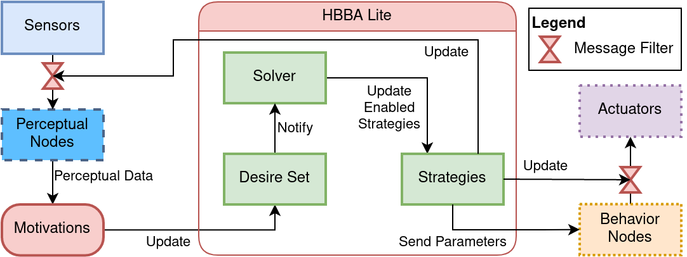

# HBBA Lite
HBBA (Hybrid Behavior-Based Architecture) is the control architecture of T-Top. A hybrid robot architecture means that perceptual nodes can communicate with the behavior nodes and the planning modules.
T-Top uses [HBBA Lite](https://github.com/introlab/hbba_lite/) implementation instead of the [original one](https://github.com/introlab/HBBA) since HBBA Lite is simpler to use but less complete.

## Definitions
The following subsections explain each element of the architecture.

### Filters
In order to disable a node, a HBBA filter blocks all messages. Also, a filter can reduce CPU usage by letting pass 1 message out of N.
An on-off filter lets pass all messages or blocks all messages. A throttling filter lets pass 1 message out of N or blocks all messages.

### Perceptual Nodes
The perceptual nodes process sensor data to extract useful information from it.
Generally, the subscriber has an on-off filter for audio data or a throttling filter for image data.

### Behavior Nodes
The behavior nodes publish messages to perform actions. For example, a behavior node can move the robot in order to follow a person.
Generally, the action message publisher has an on-off filter to disable the behavior.

### Resources
A resource represents something limited in the robot.
For example, a resource can be declared for each actuator to prevent multiple behavior nodes to use the same actuator.
Also, a resource can be declared to represent the available processing time in percent.

### Desire
A desire represents something to be fulffilled by the robot.
A desire has an intensity value that representes the level of priority of the desire. Desires with the highest intensity are priotized.
Also, it may have parameters used by the strategy.

### Strategy
A strategy represents a way to fulfill a desire. The strategy will accomplish the desire once the strategy is activated.
At least one strategy is required for each desire type.
If there are many strategies for a desire type, the strategy with the highest utility is prioritized.
A strategy has a list of filters to enable and a list resources required to be enabled.
The resources can be used to prevent conflicts of actuators between strategies.
If resources are used to manage the processing time in percent, the strategy resources can contain the estimated processing time in percent.
So, HBBA will manage the processing time of the robot.

### Desire Set
The desire set contains the current desires to fulfill. An observer pattern is implemented in the desire to get notified of changes.

### Motivations
The motivations modify the content of the desire set to make the robot do something useful.
Generally, the motivations subscribe to perceptual nodes in order to add or remove desires with respect to the robot surrounding.

### Solver
Once the solver gets the content of the desire set, it will find the best desires to fulfill with the best strategies.

The solver steps are:
1. For each type of desire in the set, find the most intense desire.
2. Find the desire-strategy combinations that maximize the sum of intensity-utility products that respect the resource constraints.

## Diagram
The following diagram illustrates how HBBA Lite works.



## Code Examples
The following sections show how to use HBBA Lite.

### Desire
The following example shows how to declare a simple desire that does not have any parameter.
```cpp
class Camera3dRecordingDesire : public Desire
{
public:
    explicit Camera3dRecordingDesire(uint16_t intensity = 1) : Desire(intensity) {}

    ~Camera3dRecordingDesire() override = default;

    // The following macro overrides the required methods to declare a Desire.
    DECLARE_DESIRE_METHODS(Camera3dRecordingDesire)

    // The macro is expanded to :
    // std::unique_ptr<Desire> clone() override { return std::make_unique<Camera3dRecordingDesire>(*this); }                            \
    // DesireType type() override { return DesireType::get<Camera3dRecordingDesire>(); }
};
```

The following example shows how to declare a desire that contains a parameter.
```cpp
class TalkDesire : public Desire
{
    // Declare the desire parameters here.
    std::string m_text;

public:
    // Add the desire parameters as arguments of the constructor.
    TalkDesire::TalkDesire(string text, uint16_t intensity) : Desire(intensity), m_text(move(text)) {}
    ~TalkDesire() override = default;

    // The following macro overrides the required methods to declare a Desire.
    DECLARE_DESIRE_METHODS(TalkDesire)

    // Add the getters of the desire parameters here.
    const std::string& text() const { return m_text; }
};
```

### Strategy
Strategies that only change the state of filters do not require creating a subclass of the strategy class.
The following example shows how to create the strategy for the `Camera3dRecordingDesire` previously defined.
```cpp
// The template argument of the class declares the desire type associated with the strategy.
auto strategy = make_unique<Strategy<Camera3dRecordingDesire>>(
        utility, // The utility of the strategy
        unordered_map<string, uint16_t>{}, // Declare the resources used by the strategy
        unordered_map<string, FilterConfiguration>{
            {"video_recorder_camera_3d/filter_state", FilterConfiguration::onOff()}}, // Declare the filters to enable and their type.
        move(filterPool)); // The instance of the class to change the filter state.
```
Generally, the previous code is put inside a function to simplify its use in other projects.
The association between the desire and the strategy is done with the template argument of the `Strategy` class.

The following example shows how to create a subclass in order to publish a message when the strategy is enabled.
Also, the strategy removes the desire of the set once the desire is completed.
```cpp
// The template argument of the Strategy class declares the desire type associated with the strategy.
class TalkStrategy : public Strategy<TalkDesire>
{
    std::shared_ptr<DesireSet> m_desireSet;
    ros::NodeHandle& m_nodeHandle;
    ros::Publisher m_talkPublisher;
    ros::Subscriber m_talkDoneSubscriber;

public:
    TalkStrategy(
        uint16_t utility, // The utility of the strategy
        std::shared_ptr<FilterPool> filterPool, // The instance of the class to change the filter state.
        std::shared_ptr<DesireSet> desireSet,
        ros::NodeHandle& nodeHandle)
        : Strategy<TalkDesire>(
            utility,
            {{"sound", 1}}, // Declare the resources used by the strategy.
            {{"talk/filter_state", FilterConfiguration::onOff()}}, // Declare the filters to enable and their type.
            move(filterPool)),
        m_desireSet(move(desireSet)),
        m_nodeHandle(nodeHandle)
    {
        // Create the publisher to send the text to say.
        m_talkPublisher = nodeHandle.advertise<talk::Text>("talk/text", 1);

        // Create the subscriber to be notified when the text has been said.
        m_talkDoneSubscriber = nodeHandle.subscribe("talk/done", 10, &TalkStrategy::talkDoneSubscriberCallback, this);
    }

    DECLARE_NOT_COPYABLE(TalkStrategy);
    DECLARE_NOT_MOVABLE(TalkStrategy);

protected:
    // Override the method to publish a message when the strategy is enabled.
    void onEnabling(const TalkDesire& desire) override
    {
        Strategy<TalkDesire>::onEnabling(desire); // Enable the filters declared in the constructor.

        // Publish the text to be said.
        talk::Text msg;
        msg.text = desire.text();
        msg.id = desire.id();
        m_talkPublisher.publish(msg);
    }

private:
    void talkDoneSubscriberCallback(const talk::Done::ConstPtr& msg)
    {
        // Remove the desire once the text is said.
        if (msg->id == desireId())
        {
            m_desireSet->removeDesire(msg->id);
        }
    }
};
```

### Desire Set
The following subsections show how to use the desire set. The DesireSet class is thread-safe, so it can be called by any thread.
Once a change has been made to the desire set, the solver will be run to update the filter states.
To prevent this behavior, a transaction can be created, so the solver will be run when the transaction is destroyed.

#### Add a Desire
```cpp
auto desire = make_unique<TalkDesire>("The text to say"); // Create the desire.
desireSet->addDesire(std::move(desire)); // Add the desire to the set.
```

If you don't need to have access to the desire instance, there is a simplified syntax.
```cpp
auto id = desireSet->addDesire<TalkDesire>("The text to say"); // Create the desire, add the desire to the set and return the id.
```

#### Remove a Desire
```cpp
desireSet->remove(id); // Remove the desire that has the provided id.
```

#### Remove All Desires
```cpp
desireSet->clear(); // Remove all desires
```

#### Remove All Desires of a Specific Type
```cpp
desireSet->removeAllDesiresOfType(DesireType::get<TalkDesire>()); // Remove all TalkDesire instances.
```

A simplied syntax exists.
```cpp
desireSet->removeAllDesiresOfType<TalkDesire>(); // Remove all TalkDesire instances.
```

#### Check Whether the Set Contains a Desire
```cpp
desireSet->contains(id); // Return a boolean indicating whether the set contains a desire that has the provided id.
```

#### Check Whether the Set Contains a Desire of a Specific Type
```cpp
// Return a boolean indicating whether the set contains a desire of type TalkDesire.
desireSet->containsAnyDesiresOfType(DesireType::get<TalkDesire>());
```

A simplied syntax exists.
```cpp
// Return a boolean indicating whether the set contains a desire of type TalkDesire.
desireSet->containsAnyDesiresOfType<TalkDesire>();
```

#### How to Create a Transaction
The following example shows how to use transactions.

```cpp
{
    auto transaction = desireSet->beginTransaction();

    // Change the desire set here.
}
// When the transaction is destroyed, the changes will be applied.
```

#### How to Use the Observer Pattern
The following example shows how to create and add an observer to the desire set.

```cpp
#include <hbba_lite/core/DesireSet.h>
#include <iostream>

class LogDesireSetObserver : public DesireSetObserver
{
public:
    void onDesireSetChanged(const std::vector<std::unique_ptr<Desire>>& desires) override
    {
        for (auto& desire : desires)
        {
            std::cout << desire->type().name() << " ";
        }
        std::cout << std::endl;
    }
};

int main(int argc, char** argv)
{
    LogDesireSetObserver observer;
    auto desireSet = make_shared<DesireSet>(); // Create the desire set.
    desireSet->addObserver(&observer);

    // All changes to the desire will be logged to the terminal.
    return 0;
}
```

### HBBA Lite Initialization
The following example shows how to initialize the HBBA Lite.

```cpp
constexpr bool WAIT_FOR_SERVICE = true;

auto desireSet = make_shared<DesireSet>(); // Create the desire set.
// Create the filter pool useful to change the filter states.
// If WAIT_FOR_SERVICE is true, the pool will wait until the service become available.
auto filterPool = make_shared<RosFilterPool>(nodeHandle, WAIT_FOR_SERVICE);

vector<unique_ptr<BaseStrategy>> strategies;
// Add the strategies related to the application into the vector.

auto solver = make_unique<GecodeSolver>(); // Create the solver.
HbbaLite hbba(desireSet,
    move(strategies),
    {{"sound", 1}}, // The resource available on the robot.
    move(solver)); // The constructor starts a thread for the solver.


// Add desires to the set.
```

### Filters
The following examples show how to add a filter to a perceptual node or a behavior node.
By default, the service name to modify the state of the filter is `topic_name/filter_state`.

#### C++ Subscriber
```cpp
#include <ros/ros.h>
#include <std_msgs/Int8.h>

#include <hbba_lite/filters/Subscribers.h>

void callback(const std_msgs::Int8::ConstPtr& msg)
{
    ROS_INFO("Data received : %i", static_cast<int>(msg->data));
}

int main(int argc, char** argv)
{
    ros::init(argc, argv, "node_name");
    ros::NodeHandle nodeHandle;

    // Replace this
    ros::Subscriber sub = n.subscribe("int_topic", 10, callback);

    // with this to add an on/off filter
    OnOffHbbaSubscriber<std_msgs::Int8> sub(nodeHandle, "int_topic", 10, &callback);

    // or with this to add a throttling filter
    ThrottlingHbbaSubscriber<std_msgs::Int8> sub(nodeHandle, "int_topic", 10, &callback);
    ros::spin();

    return 0;
}
```

#### C++ Publisher
```cpp
#include <ros/ros.h>
#include <std_msgs/Int8.h>

#include <hbba_lite/filters/Publishers.h>

int main(int argc, char** argv)
{
    ros::init(argc, argv, "node_name");
    ros::NodeHandle nodeHandle;

    // Replace this
    ros::Publisher pub = n.advertise<std_msgs::Int8>("int_topic", 10);

    // with this to add an on/off filter
    OnOffHbbaPublisher<std_msgs::Int8> pub(nodeHandle, "int_topic", 10);

    // or with this to add a throttling filter
    ThrottlingHbbaPublisher<std_msgs::Int8> pub(nodeHandle, "int_topic", 10);

    return 0;
}
```

#### Python Subscriber
```python
import rospy
from std_msgs.msg import Int8
import hbba_lite


def callback(data):
    rospy.loginfo('Data received : {}'.format(data.data))


def main():
    rospy.init_node('node_name')

    # Replace this
    sub = rospy.Subscriber("int_topic", Int8, callback)

    # with this to add an on/off filter
    sub = hbba_lite.OnOffHbbaSubscriber('int_topic', Int8, callback)

    # or with this to add a throttling filter
    sub = hbba_lite.ThrottlingHbbaSubscriber('int_topic', Int8, callback)

    rospy.spin()


if __name__ == '__main__':
    main()
```

#### Python Publisher
```python
import rospy
from std_msgs.msg import Int8
import hbba_lite


def main():
    rospy.init_node('node_name')

    # Replace this
    pub = rospy.Publisher('int_topic', Int8, queue_size=10)

    # with this to add an on/off filter
    pub = hbba_lite.OnOffHbbaPublisher('int_topic', Int8, queue_size=10)

    # or with this to add a throttling filter
    pub = hbba_lite.ThrottlingHbbaPublisher('int_topic', Int8, queue_size=10)


if __name__ == '__main__':
    main()
```


## T-Top
The following sections present T-Top specific information.

### Resources
- `motor`: The resource to prevent conflicts over the motors.
- `audio`: The resource to prevent conflicts over the sound output.
- `led`: The resource to prevent conflicts over the LEDs.

### Desire Types
- [`Camera3dRecordingDesire`](../../ros/utils/t_top_hbba_lite/include/t_top_hbba_lite/Desires.h#L12): To enable the recording of the 3D camera.
- [`Camera2dWideRecordingDesire`](../../ros/utils/t_top_hbba_lite/include/t_top_hbba_lite/Desires.h#L22): To enable the recording of the 2D Wide camera.
- [`RobotNameDetectorDesire`](../../ros/utils/t_top_hbba_lite/include/t_top_hbba_lite/Desires.h#L32): To enable the robot name detector node.
- [`RobotNameDetectorWithLedStatusDesire`](../../ros/utils/t_top_hbba_lite/include/t_top_hbba_lite/Desires.h#L42): To enable the robot name detector node and have feed on the LED strip.
- [`SlowVideoAnalyzer3dDesire`](../../ros/utils/t_top_hbba_lite/include/t_top_hbba_lite/Desires.h#52): To enable the video analyzer node for the 3D camera at 1 Hz.
- [`FastVideoAnalyzer3dDesire`](../../ros/utils/t_top_hbba_lite/include/t_top_hbba_lite/Desires.h#L62): To enable the video analyzer node for the 3D camera at 5 Hz.
- [`FastVideoAnalyzer3dWithAnalyzedImageDesire`](../../ros/utils/t_top_hbba_lite/include/t_top_hbba_lite/Desires.h#L72): To enable the video analyzer node for the 3D camera at 5 Hz and to publish the analyzed image.
- [`SlowVideoAnalyzer2dWideDesire`](../../ros/utils/t_top_hbba_lite/include/t_top_hbba_lite/Desires.h#L82): To enable the video analyzer node for the 2D wide camera at 1 Hz.
- [`FastVideoAnalyzer2dWideDesire`](../../ros/utils/t_top_hbba_lite/include/t_top_hbba_lite/Desires.h#92): To enable the video analyzer node for the 2D wide camera at 5 Hz.
- [`FastVideoAnalyzer2dWideWithAnalyzedImageDesire`](../../ros/utils/t_top_hbba_lite/include/t_top_hbba_lite/Desires.h#L102): To enable the video analyzer node for the 2D wide camera at 5 Hz and to publish the analyzed image.
- [`AudioAnalyzerDesire`](../../ros/utils/t_top_hbba_lite/include/t_top_hbba_lite/Desires.h#L112): To enable the audio analyzer node.
- [`VadDesire`](../../ros/utils/t_top_hbba_lite/include/t_top_hbba_lite/Desires.h#L122): To enable to VAD node.
- [`SpeechToTextDesire`](../../ros/utils/t_top_hbba_lite/include/t_top_hbba_lite/Desires.h#L132): To enable the speech to text node.
- [`ExploreDesire`](../../ros/utils/t_top_hbba_lite/include/t_top_hbba_lite/Desires.h#L142): To enable the explore node.
- [`FaceAnimationDesire`](../../ros/utils/t_top_hbba_lite/include/t_top_hbba_lite/Desires.h#L152): To change the face animation.
- [`LedEmotionDesire`](../../ros/utils/t_top_hbba_lite/include/t_top_hbba_lite/Desires.h#L175): To enable the led emotion node.
- [`LedAnimationDesire`](../../ros/utils/t_top_hbba_lite/include/t_top_hbba_lite/Desires.h#L197): To enable the led animation node.
- [`SoundFollowingDesire`](../../ros/utils/t_top_hbba_lite/include/t_top_hbba_lite/Desires.h#L245): To enable the node that makes T-Top follow the loudest sound.
- [`NearestFaceFollowingDesire`](../../ros/utils/t_top_hbba_lite/include/t_top_hbba_lite/Desires.h#L255): To enable the node that makes T-Top follow the nearest face.
- [`SpecificFaceFollowingDesire`](../../ros/utils/t_top_hbba_lite/include/t_top_hbba_lite/Desires.h#L265): To enable the node that makes T-Top follow a specific face.
- [`SoundObjectPersonFollowingDesire`](../../ros/utils/t_top_hbba_lite/include/t_top_hbba_lite/Desires.h#L284): To enable the node that makes T-Top follow the loudest sound, the people and the objects.
- [`TalkDesire`](../../ros/utils/t_top_hbba_lite/include/t_top_hbba_lite/Desires.h#L294): To make T-Top talk.
- [`GestureDesire`](../../ros/utils/t_top_hbba_lite/include/t_top_hbba_lite/Desires.h#L313): To make T-Top perform a head gesture.
- [`DanceDesire`](../../ros/utils/t_top_hbba_lite/include/t_top_hbba_lite/Desires.h#L335): To make T-Top dance.
- [`PlaySoundDesire`](../../ros/utils/t_top_hbba_lite/include/t_top_hbba_lite/Desires.h#L345): To make T-Top play a sound file.
- [`TelepresenceDesire`](../../ros/utils/t_top_hbba_lite/include/t_top_hbba_lite/Desires.h#L364): To make T-Top perform a video call
- [`TeleoperationDesire`](../../ros/utils/t_top_hbba_lite/include/t_top_hbba_lite/Desires.h#L374): To enable remote control of T-Top.

### Strategies
The strategies are declared in the following files: [Strategies.h](../../ros/utils/t_top_hbba_lite/include/t_top_hbba_lite/Strategies.h) and [Strategies.cpp](../../ros/utils/t_top_hbba_lite/src/Strategies.cpp).
