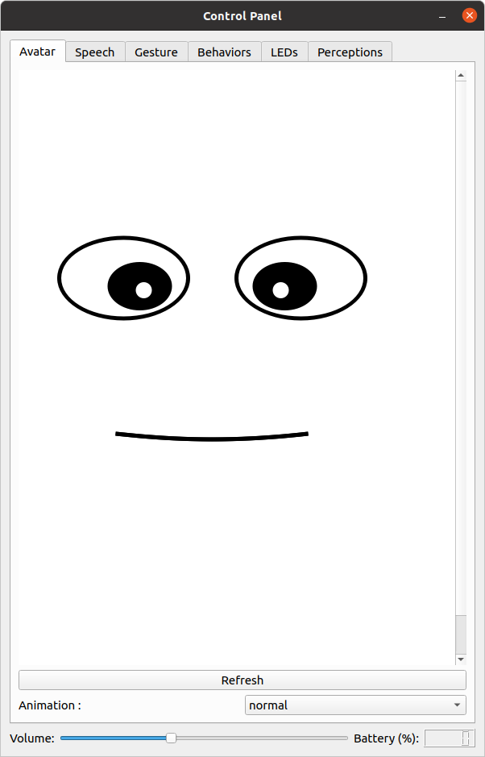
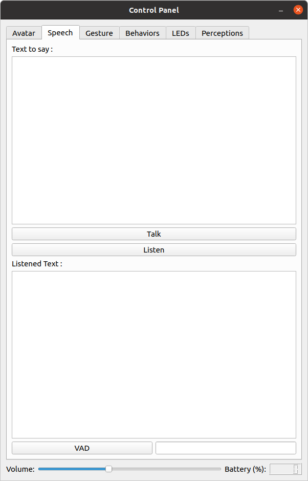
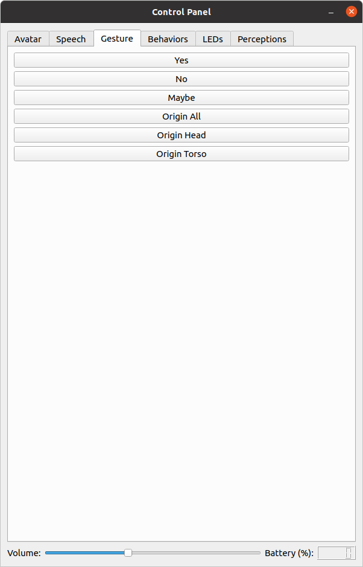
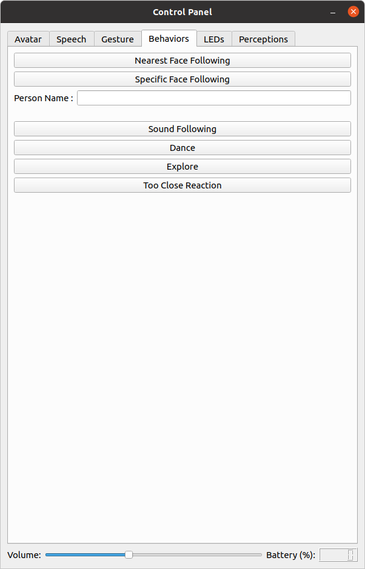
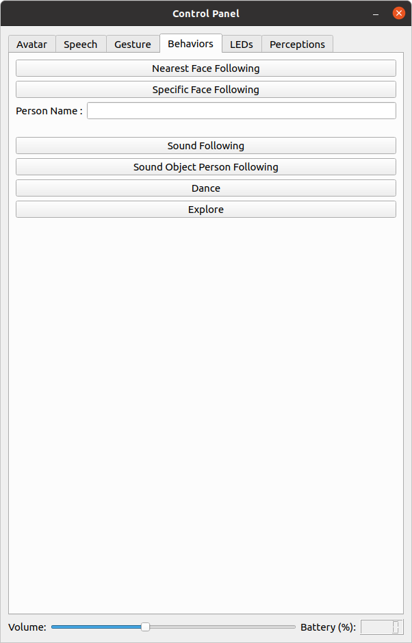
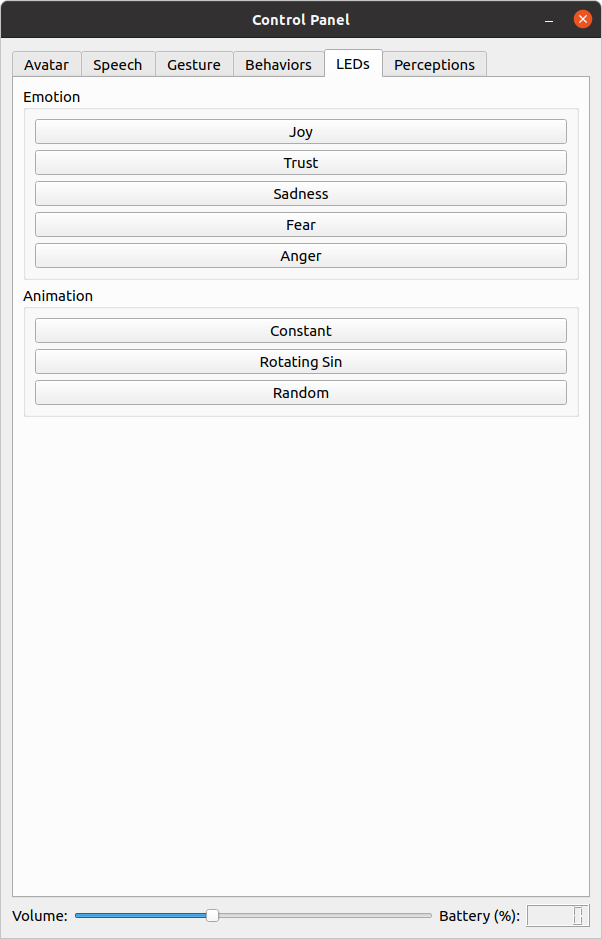
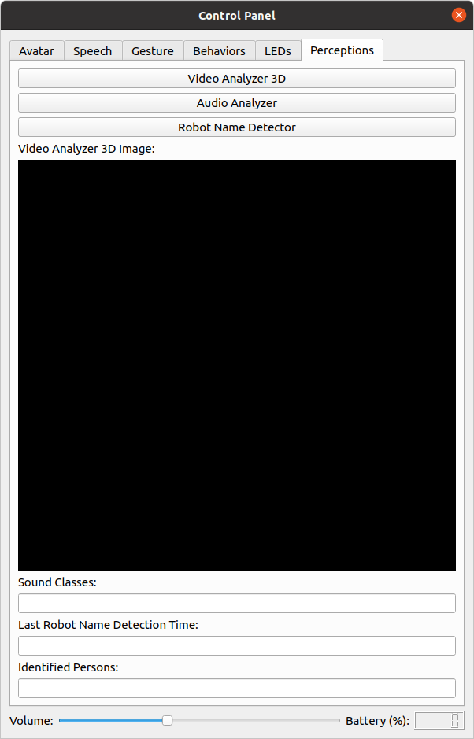
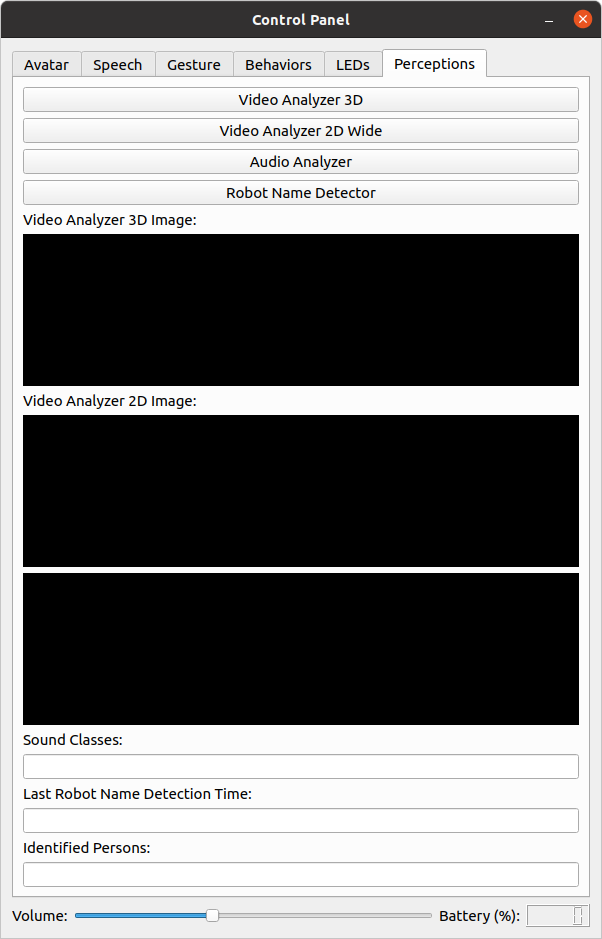

# control_panel

This is a graphical user interface to control T-Top's features manually. The control is done
with [hbba_lite](../../hbba_lite).

## How to Launch

```bash
roslaunch control_panel control_panel.launch
```

## Interface Description

At the bottom, there are a slider to change the volume of the audio amplifiers and a widget showing the battery level.
The Avatar tab shows the avatar. Also, it contains a button to refresh the web page and a combo box to choose the facial
animation. The Speech tab contains a button to make T-Top say the specified text and another one to make T-Top perform
speech to text. The result of the speech to text is shown below the Listen button. The Gesture tab contains buttons to
perform gestures. The Behaviors tab contains buttons to enable behaviors. The Perception tab contains buttons to enable
perceptual nodes and widgets to show their result.

| Without the 2d wide camera                 | With the 2d wide camera                                        |
| ------------------------------------------ | -------------------------------------------------------------- |
|            |                                |
|            |                                |
|          |                              |
|       |       |
|                |                                    |
|  |  |
