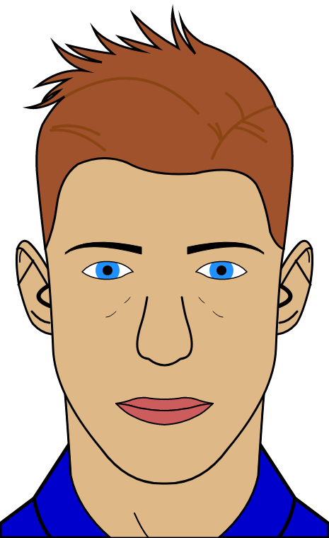
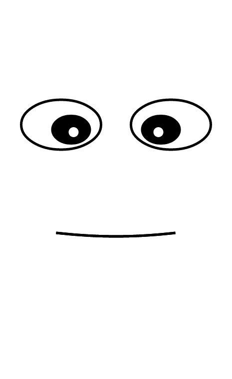

# user_interface

This folder contains the web user interface for the robot face.




## Package setup

```
npm install
```

## Compiles and hot-reloads for development

```
npm run serve
```

## Published Topics

- `face/animation` ([std_msgs/String](https://docs.ros.org/en/humble/p/std_msgs/interfaces/msg/String.html)): Indicates the
  actual animation.
- `face/mouth_signal_scale` ([std_msgs/Float32](https://docs.ros.org/en/humble/p/std_msgs/interfaces/msg/Float32.html)):
  Indicates how much the mouth must be open.
