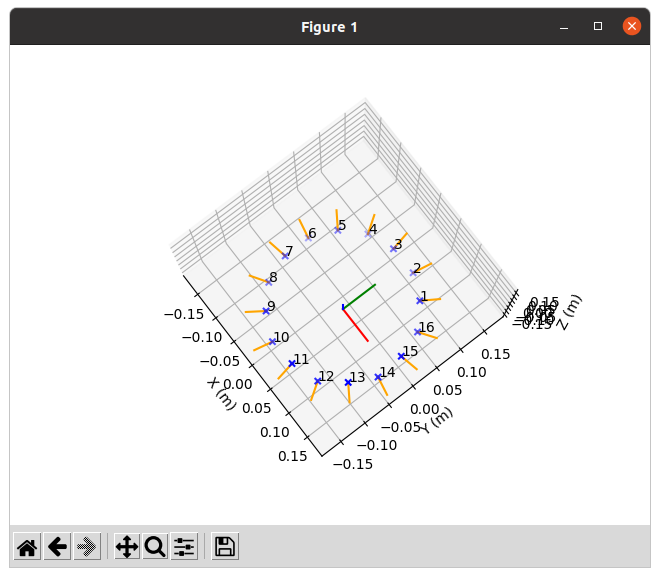

# Odas Configuration Generator
This is a tool to generate the microphone configuration for [ODAS](https://github.com/introlab/odas).



## Setup
1. Setup the Python virtual environment.
```bash
python3 -m venv venv
source venv/bin/activate
pip install -r requirements.txt
```

2. Run the generator.
```bash
python3 odas_microphone_configuration.py
```
