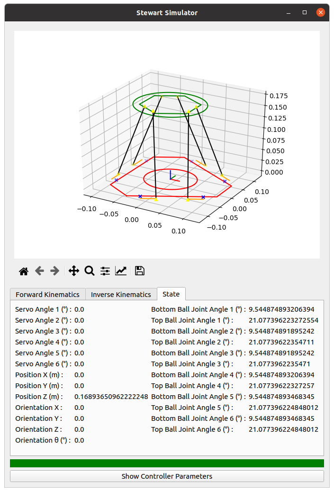

# Stewart Simulator
This is a tool to design the Stewart platform and generate the controller code.

## Folder Structure
- The [configuration](configuration), [controller_parameters](controller_parameters), [state](state) and [ui](ui) folders contain the Python code.
- The [configuration.json](configuration.json) describes the Stewart platform.

## Interface
The top part shows the Stewart platform with the current configuration. The tabs at the bottom are used to display the state and control the Stewart platform with the servo angles, the position and the orientation.
When controlling the platform with the position and the orientation, the green bar will turn red if the position or the orientation is not achievable.

### Forward Kinematics


### Inverse Kinematics


### State


## How to use?
1. Setup the Python virtual environment.
```bash
python3 -m venv venv
source venv/bin/activate
pip install -r requirements.txt
```

2. Configure the Stewart platform ([configuration.json](configuration.json)).
3. Run the simulator.
```bash
python stewart_simulator.py
```
